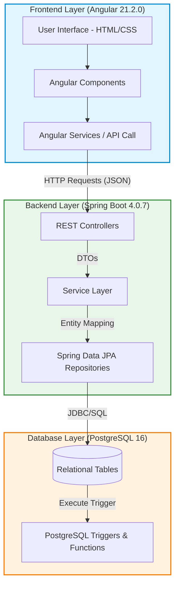
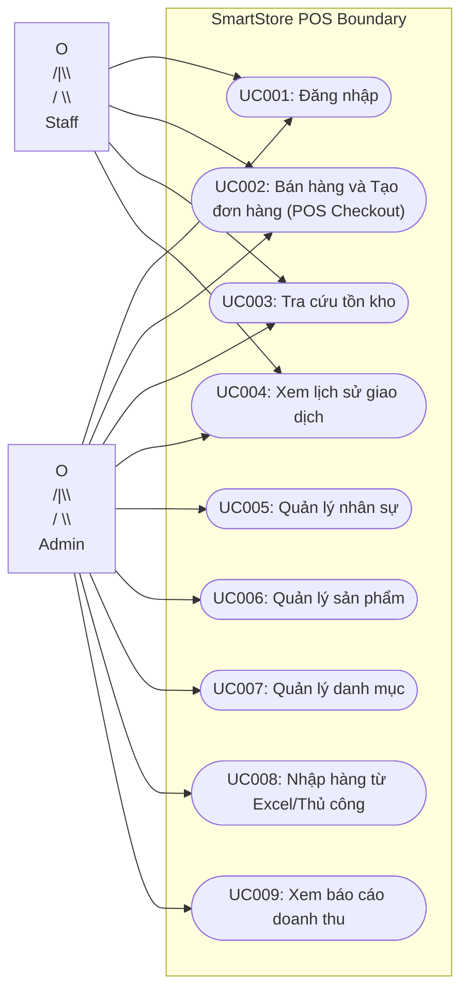
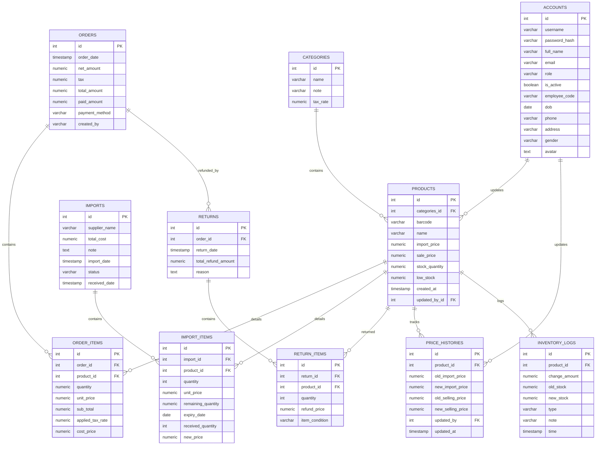
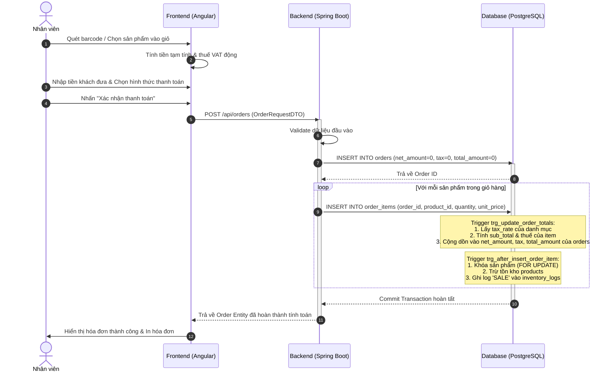
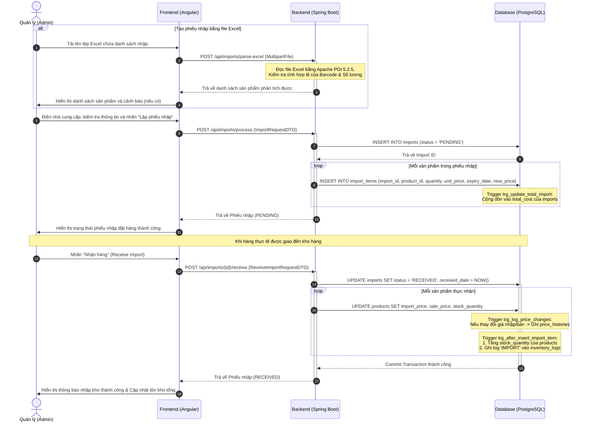
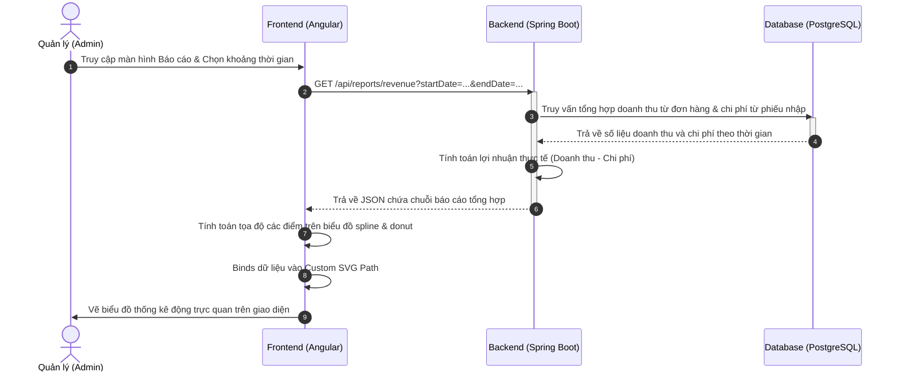
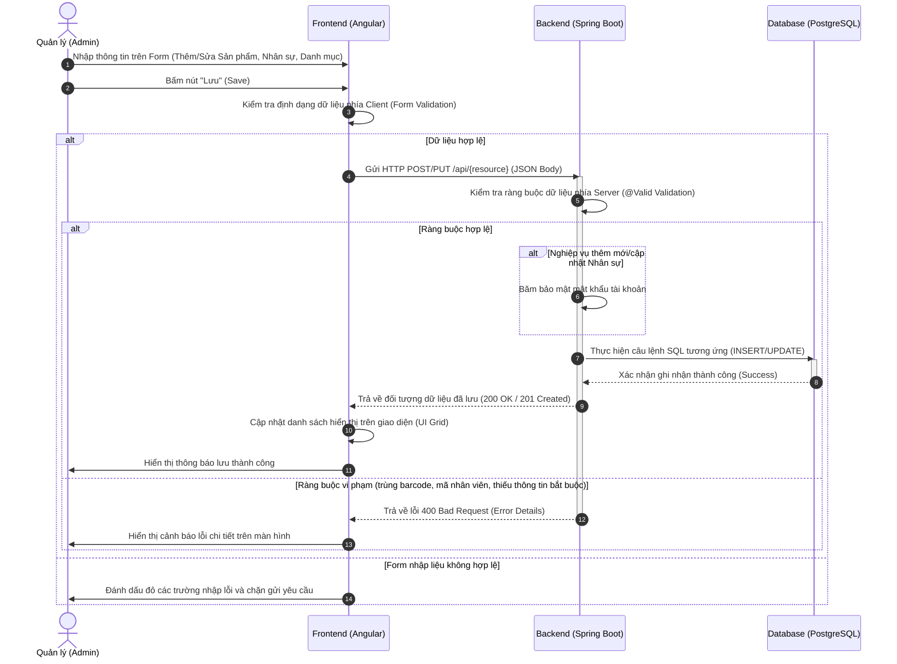

# BÁO CÁO ĐỒ ÁN MÔN HỌC: PROJECT 2 - Project II (IT3930)
## Đề tài: Hệ thống quản lý bán hàng SmartStore (POS Management System)
**Giảng viên hướng dẫn:** Vũ Đức Vượng  
**Sinh viên thực hiện:** Dương Gia Huy  
**Mã số sinh viên:** 20236035  
**Trường:** Đại học Bách Khoa Hà Nội  

## MỤC LỤC
- (điền sau tự làm)


# I. TỔNG QUAN ĐỀ TÀI

## 1.1. Đặt vấn đề (Sự cần thiết của hệ thống quản lý bán hàng POS)
Trong bối cảnh chuyển đổi số của ngành bán lẻ, các cửa hàng truyền thống đang gặp nhiều khó khăn khi quản lý thủ công qua sổ sách hoặc Excel do các hạn chế lớn sau:
- Tốc độ thanh toán chậm và dễ xảy ra sai sót khi tính toán thủ công.
- Không theo dõi được biến động số lượng hàng tồn kho theo thời gian thực.
- Khó cập nhật và kiểm soát lịch sử thay đổi giá bán cũng như giá nhập sản phẩm.
- Dễ thất thoát tài chính do thiếu cơ chế lưu vết hóa đơn và nhật ký kho.

Do đó, việc xây dựng hệ thống bán hàng tại quầy (POS) tự động hóa và tin cậy là vô cùng cấp thiết nhằm chuẩn hóa quy trình giao dịch, tối ưu hóa vận hành và bảo vệ toàn vẹn dữ liệu.

## 1.2. Mục tiêu đề tài (SmartStore POS Management System)
Đề tài nghiên cứu và xây dựng hệ thống **SmartStore POS Management System** nhằm giải quyết triệt để các thách thức trong quản lý bán lẻ thông qua các mục tiêu cụ thể sau:
- Tự động hóa quy trình bán hàng bằng giao diện POS trực quan, hỗ trợ tính tiền, thuế VAT động và đa dạng phương thức thanh toán.
- Kiểm soát tồn kho thời gian thực qua cơ chế tự động cộng trừ kho khi bán hàng, nhập kho hoặc hoàn trả hàng.
- Bảo vệ toàn vẹn dữ liệu hệ thống bằng cách lưu vết lịch sử biến động giá, nhật ký kho và ngăn chặn hành vi xóa hóa đơn.
- Quản lý nhập hàng từ nhà cung cấp và cho phép cập nhật nhanh giá bán trực tiếp tại thời điểm nhập kho.
- Thống kê doanh thu, chi phí nhập và lợi nhuận thực tế thông qua các biểu đồ báo cáo trực quan.

## 1.3. Phạm vi nghiên cứu và đối tượng áp dụng
- Phạm vi nghiên cứu tập trung vào kiến trúc ứng dụng Web 3 lớp phân tách độc lập (Angular, Spring Boot, PostgreSQL) và tối ưu hóa xử lý nghiệp vụ thông qua Trigger/Functions ở tầng cơ sở dữ liệu.
- Đối tượng áp dụng hướng tới các cửa hàng bán lẻ quy mô vừa và nhỏ cần quản lý bán hàng tập trung với hai vai trò người dùng chính là nhân viên bán hàng và quản trị viên.

---

# II. CƠ SỞ LÝ THUYẾT VÀ CÔNG NGHỆ SỬ DỤNG

*Bảng 2.1 - Các phiên bản công nghệ sử dụng thực tế trong dự án SmartStore*

| Thành phần | Công nghệ / Thư viện | Phiên bản thực tế trong dự án | Vai trò trong hệ thống |
|---|---|---|---|
| **Frontend** | Angular Framework | 21.2.0 | Xây dựng giao diện Single Page Application (SPA), quản lý luồng dữ liệu và định tuyến |
| **Frontend** | TypeScript | 5.9.2 | Ngôn ngữ lập trình chính cho Frontend với hệ thống kiểm soát kiểu dữ liệu tĩnh |
| **Frontend** | RxJS | 7.8.0 | Xử lý các luồng sự kiện bất đồng bộ và tối ưu tương tác API |
| **Backend** | Java | 21 (LTS) | Nền tảng thực thi ứng dụng phía Server |
| **Backend** | Spring Boot | 4.0.7 | Framework phát triển Backend RESTful API, quản lý Dependency Injection và cấu hình tự động |
| **Backend** | Spring Data JPA (Hibernate) | Tích hợp sẵn | Truy cập và ánh xạ dữ liệu quan hệ (ORM) sang đối tượng Java |
| **Backend** | Apache POI | 5.2.5 | Đọc và xử lý tệp tin Excel phục vụ nghiệp vụ nhập hàng loạt |
| **Database** | PostgreSQL | PostgreSQL Dialect | Hệ quản trị cơ sở dữ liệu quan hệ lưu trữ dữ liệu và xử lý nghiệp vụ qua Trigger |

## 2.1. Kiến trúc hệ thống Client-Server (RESTful API Web Application)
Hệ thống SmartStore tuân thủ mô hình kiến trúc 3 lớp (3-tier architecture) tiêu chuẩn, cho phép phân tách độc lập giữa giao diện người dùng, logic xử lý nghiệp vụ và lưu trữ dữ liệu:


*Hình 2.1 - Sơ đồ kiến trúc 3 lớp của hệ thống SmartStore POS*

Sự tương tác giữa các lớp được thực hiện qua giao thức HTTP/HTTPS với kiến trúc **RESTful API**:
1. **Presentation Layer (Client - Angular):** Xây dựng giao diện động, tiếp nhận tương tác và gửi yêu cầu bất đồng bộ dưới dạng JSON tới Backend nhằm đảm bảo tính bảo mật và giảm tải cho Client.
2. **Application Layer (Server - Spring Boot):** Tiếp nhận API, kiểm tra tính hợp lệ dữ liệu (Validation), điều phối luồng xử lý và giao tiếp với Database qua Spring Data JPA.
3. **Database Layer (PostgreSQL):** Lưu trữ dữ liệu và tích hợp logic nghiệp vụ nặng qua **Trigger & Function** (tính toán hóa đơn, cập nhật tồn kho, ghi log), giúp ngăn chặn Race Condition khi có nhiều giao dịch đồng thời.

## 2.2. Công nghệ phía Frontend (Angular 21 & TypeScript)
Dự án lựa chọn **Angular** làm nền tảng toàn diện phát triển phía Client với các công nghệ chính:
- **Angular Framework (21.2.0):** Xây dựng ứng dụng SPA hiệu năng cao. Cơ chế Routing định tuyến mượt mà và Form Module hỗ trợ xử lý dữ liệu nhập tại quầy theo thời gian thực.
- **TypeScript (5.9.2):** Hỗ trợ kiểm soát kiểu dữ liệu tĩnh (Strong Typing), phát hiện lỗi trong quá trình biên dịch và đồng bộ interface dữ liệu với Backend.
- **RxJS (7.8.0):** Xử lý bất đồng bộ các luồng sự kiện (gọi API, tìm kiếm sản phẩm real-time với debounce time) giúp tối ưu hóa hiệu năng giao diện.

## 2.3. Công nghệ phía Backend (Java & Spring Boot 3 / Thực tế Java 21 & Spring Boot 4.0.7)
Mã nguồn Backend tổ chức dựa trên Java kết hợp các công nghệ cấu hình trong `pom.xml`:
- **Java 21 (LTS):** Cải tiến hiệu năng bộ nhớ và hỗ trợ các cú pháp lập trình hiện đại, tối ưu hóa xử lý đa luồng.
- **Spring Boot (4.0.7):** Rút ngắn thời gian phát triển thông qua các thư viện tự cấu hình:
  - `spring-boot-starter-webmvc`: Xây dựng RESTful API và định tuyến endpoint.
  - `spring-boot-starter-data-jpa`: Tích hợp ORM Hibernate truy xuất cơ sở dữ liệu nhanh chóng.
  - `spring-boot-starter-validation`: Kiểm tra ràng buộc dữ liệu đầu vào trực tiếp từ tầng Controller.
- **Apache POI (5.2.5):** Đọc ghi Excel, hỗ trợ nhập hàng loạt sản phẩm và hóa đơn từ file mẫu.
- **Lombok:** Tự động sinh mã Boilerplate (getter, setter, constructor) qua Annotation, tối giản mã nguồn.

## 2.4. Hệ quản trị cơ sở dữ liệu (PostgreSQL 16)
Hệ thống sử dụng **PostgreSQL 16** để quản lý dữ liệu:
- **Cấu hình kết nối & Đồng bộ:** Kết nối qua `project2_db` trong `application.properties`. Hệ thống đặt `ddl-auto=none` và khởi tạo cấu trúc bảng hoàn toàn thông qua tệp [database.sql](file:///d:/Hust/project.2/database.sql) để kiểm soát cấu trúc chặt chẽ.
- **Xử lý nghiệp vụ tại database:** Toàn bộ logic cập nhật tồn kho được đẩy xuống PostgreSQL bằng **Trigger** kết hợp từ khóa **FOR UPDATE** để khóa dòng dữ liệu sản phẩm, tránh lỗi Race Condition. Khi chèn dữ liệu vào bảng chi tiết (`order_items`, `import_items`), trigger sẽ tự động cập nhật số lượng tồn kho, tính thuế VAT động, cập nhật lịch sử giá và ghi nhật ký thay đổi (`inventory_logs`).

---

# III. PHÂN TÍCH VÀ THIẾT KẾ HỆ THỐNG

## 3.1. Phân tích yêu cầu chức năng (Sơ đồ Use Case tổng quan và đặc tả chi tiết)

Hệ thống có hai tác nhân chính là **Quản trị viên (Admin)** và **Nhân viên bán hàng (Staff)**. 


*Hình 3.1 - Sơ đồ Use Case tổng quan hệ thống SmartStore*

### Đặc tả chi tiết ca sử dụng cốt lõi:

*Bảng 3.1 - Đặc tả ca sử dụng UC002: Bán hàng và Tạo đơn hàng (POS Checkout)*

| Thành phần đặc tả | Nội dung chi tiết |
|---|---|
| **Tên ca sử dụng** | UC002: Bán hàng và Tạo đơn hàng (POS Checkout) |
| **Tác nhân** | Nhân viên bán hàng (Staff), Quản trị viên (Admin) |
| **Mô tả ngắn** | Nhân viên chọn sản phẩm từ danh sách hoặc quét barcode, hệ thống tự động tính tổng tiền, thuế VAT động, tiền thừa và tạo đơn hàng. |
| **Điều kiện tiên quyết** | Nhân viên đã đăng nhập thành công vào hệ thống. |
| **Luồng sự kiện chính** | 1. Nhân viên tìm kiếm sản phẩm hoặc quét mã vạch sản phẩm để thêm vào giỏ hàng.<br>2. Hệ thống truy vấn thông tin sản phẩm, tự động tính thuế VAT dựa trên danh mục.<br>3. Nhân viên điều chỉnh số lượng sản phẩm.<br>4. Hệ thống cập nhật tổng tiền cần thanh toán.<br>5. Nhân viên chọn phương thức thanh toán (Tiền mặt/Thẻ/QR). Nhập số tiền nhận từ khách.<br>6. Hệ thống tự động tính tiền thừa và nhân viên nhấn nút xác nhận thanh toán.<br>7. Hệ thống ghi nhận đơn hàng mới và kích hoạt trigger tự động trừ số lượng kho hàng. |
| **Điều kiện sau** | Số lượng tồn kho được cập nhật chính xác, đơn hàng được ghi nhận thành công. |

*Bảng 3.2 - Đặc tả ca sử dụng UC008: Nhập hàng (Import)*

| Thành phần đặc tả | Nội dung chi tiết |
|---|---|
| **Tên ca sử dụng** | UC008: Nhập hàng |
| **Tác nhân** | Quản trị viên (Admin) |
| **Mô tả ngắn** | Admin tạo phiếu nhập kho (thủ công hoặc nhập hàng loạt từ tệp Excel), cập nhật giá nhập/bán và số lượng tồn kho của các sản phẩm. |
| **Điều kiện tiên quyết** | Tài khoản có quyền Admin và các sản phẩm đã được khai báo trên hệ thống. |
| **Luồng sự kiện chính** | 1. Admin truy cập màn hình Nhập hàng và chọn hình thức tạo phiếu nhập (chọn sản phẩm thủ công hoặc tải lên tệp Excel).<br>2. Admin điền thông tin nhà cung cấp, số lượng nhập, giá nhập và giá bán mới.<br>3. Admin gửi yêu cầu xác nhận lưu phiếu nhập ở trạng thái PENDING.<br>4. Khi hàng về kho thực tế, Admin kiểm tra số lượng và bấm xác nhận nhận hàng (RECEIVE).<br>5. Hệ thống cập nhật trạng thái phiếu nhập thành RECEIVED, tăng tồn kho sản phẩm tương ứng và lưu lịch sử thay đổi giá nếu có. |
| **Điều kiện sau** | Tồn kho sản phẩm được cộng thêm tương ứng, tệp nhật ký kho và lịch sử giá được cập nhật. |


## 3.2. Thiết kế Cơ sở dữ liệu (Sơ đồ thực thể liên kết ERD và mô tả chi tiết các bảng)

Mối quan hệ giữa các bảng dữ liệu trong cơ sở dữ liệu `project2_db` được thể hiện qua sơ đồ thực thể liên kết (ERD) dưới đây:


*Hình 3.2 - Sơ đồ thực thể liên kết ERD của hệ thống SmartStore*

### Mô tả chi tiết các bảng dữ liệu:

*Bảng 3.4 - Cấu trúc bảng accounts (Tài khoản người dùng)*

| Tên cột | Kiểu dữ liệu | Ràng buộc | Mô tả |
|---|---|---|---|
| `id` | SERIAL | PRIMARY KEY | Khóa chính tự tăng |
| `username` | VARCHAR(50) | UNIQUE, NOT NULL | Tên đăng nhập |
| `password_hash` | TEXT | NOT NULL | Mật khẩu mã hóa |
| `full_name` | VARCHAR(100) | NOT NULL | Họ và tên |
| `email` | VARCHAR(100) | UNIQUE | Địa chỉ email |
| `role` | VARCHAR(20) | DEFAULT 'staff' | Vai trò (admin/staff) |
| `is_active` | BOOLEAN | DEFAULT TRUE | Trạng thái hoạt động |
| `employee_code` | VARCHAR(50) | UNIQUE | Mã số nhân viên |
| `dob` | DATE | | Ngày sinh |
| `phone` | VARCHAR(20) | | Số điện thoại |
| `address` | VARCHAR(255) | | Địa chỉ |
| `gender` | VARCHAR(20) | | Giới tính |
| `avatar` | TEXT | | Đường dẫn ảnh đại diện |

*Bảng 3.5 - Cấu trúc bảng categories (Danh mục sản phẩm)*

| Tên cột | Kiểu dữ liệu | Ràng buộc | Mô tả |
|---|---|---|---|
| `id` | SERIAL | PRIMARY KEY | Khóa chính tự tăng |
| `name` | VARCHAR(100) | UNIQUE, NOT NULL | Tên danh mục |
| `note` | VARCHAR(255) | | Ghi chú |
| `tax_rate` | NUMERIC | DEFAULT 0.08 | Thuế suất áp dụng (ví dụ 0.08 hoặc 0.10) |

*Bảng 3.6 - Cấu trúc bảng products (Thông tin sản phẩm)*

| Tên cột | Kiểu dữ liệu | Ràng buộc | Mô tả |
|---|---|---|---|
| `id` | SERIAL | PRIMARY KEY | Khóa chính tự tăng |
| `categories_id` | INTEGER | FK (categories.id) | Khóa ngoại danh mục sản phẩm |
| `barcode` | VARCHAR(50) | UNIQUE, NOT NULL | Mã vạch sản phẩm |
| `name` | VARCHAR(255) | NOT NULL | Tên sản phẩm |
| `import_price` | NUMERIC | NOT NULL, >= 0 | Giá nhập hàng hiện tại |
| `sale_price` | NUMERIC | NOT NULL, >= 0 | Giá bán ra hiện tại |
| `stock_quantity` | NUMERIC | DEFAULT 0 | Số lượng tồn kho thực tế |
| `low_stock` | NUMERIC | DEFAULT 10 | Ngưỡng cảnh báo tồn kho thấp |
| `created_at` | TIMESTAMPTZ | | Ngày giờ tạo |
| `updated_by_id` | INTEGER | FK (accounts.id) | Người cập nhật gần nhất |

*Bảng 3.7 - Cấu trúc bảng orders (Hóa đơn bán hàng)*

| Tên cột | Kiểu dữ liệu | Ràng buộc | Mô tả |
|---|---|---|---|
| `id` | SERIAL | PRIMARY KEY | Khóa chính tự tăng |
| `order_date` | TIMESTAMPTZ | | Ngày giờ lập hóa đơn |
| `net_amount` | NUMERIC | DEFAULT 0, >= 0 | Tổng tiền hàng chưa thuế |
| `tax` | NUMERIC | DEFAULT 0, >= 0 | Tổng tiền thuế VAT |
| `total_amount` | NUMERIC | DEFAULT 0, >= 0 | Tổng giá trị hóa đơn (tiền thanh toán) |
| `paid_amount` | NUMERIC | DEFAULT 0 | Số tiền khách đã trả |
| `payment_method` | VARCHAR(50) | | Phương thức (Cash/Card/QR) |
| `created_by` | VARCHAR(50) | | Tên và mã nhân viên lập hóa đơn |

*Bảng 3.8 - Cấu trúc bảng order_items (Chi tiết hóa đơn)*

| Tên cột | Kiểu dữ liệu | Ràng buộc | Mô tả |
|---|---|---|---|
| `id` | SERIAL | PRIMARY KEY | Khóa chính tự tăng |
| `order_id` | INTEGER | FK (orders.id) ON DELETE CASCADE | Khóa ngoại hóa đơn |
| `product_id` | INTEGER | FK (products.id) | Khóa ngoại sản phẩm |
| `quantity` | NUMERIC | NOT NULL, > 0 | Số lượng bán |
| `unit_price` | NUMERIC | NOT NULL, >= 0 | Đơn giá bán tại thời điểm mua |
| `sub_total` | NUMERIC | | Tiền hàng chưa thuế (Qty * Price) |
| `applied_tax_rate`| NUMERIC | | Mức thuế suất áp dụng tại thời điểm bán |
| `cost_price` | NUMERIC(15,2) | | Giá nhập gốc sản phẩm tại thời điểm bán |

*Bảng 3.9 - Cấu trúc bảng imports (Phiếu nhập kho)*

| Tên cột | Kiểu dữ liệu | Ràng buộc | Mô tả |
|---|---|---|---|
| `id` | SERIAL | PRIMARY KEY | Khóa chính tự tăng |
| `supplier_name` | VARCHAR(255) | | Tên nhà cung cấp |
| `total_cost` | NUMERIC | DEFAULT 0 | Tổng chi phí nhập hàng |
| `note` | TEXT | | Ghi chú phiếu nhập |
| `import_date` | TIMESTAMPTZ | DEFAULT NOW() | Ngày tạo phiếu nhập |
| `status` | VARCHAR(50) | DEFAULT 'PENDING' | Trạng thái (PENDING/RECEIVED/CANCELLED) |
| `received_date` | TIMESTAMPTZ | | Ngày thực nhận hàng về kho |

*Bảng 3.10 - Cấu trúc bảng import_items (Chi tiết phiếu nhập)*

| Tên cột | Kiểu dữ liệu | Ràng buộc | Mô tả |
|---|---|---|---|
| `id` | SERIAL | PRIMARY KEY | Khóa chính tự tăng |
| `import_id` | INTEGER | FK (imports.id) ON DELETE CASCADE | Khóa ngoại phiếu nhập |
| `product_id` | INTEGER | FK (products.id) | Khóa ngoại sản phẩm |
| `quantity` | INTEGER | NOT NULL | Số lượng đặt hàng |
| `unit_price` | NUMERIC(15,2) | NOT NULL | Giá nhập hàng dự kiến |
| `remaining_quantity`| NUMERIC(15,2)| | Số lượng còn lại trong lô (quản lý FEFO) |
| `expiry_date` | DATE | | Hạn sử dụng của sản phẩm trong lô |
| `received_quantity`| INTEGER | DEFAULT 0 | Số lượng hàng thực nhận |
| `new_price` | NUMERIC(15,2) | | Giá bán mới áp dụng sau khi nhập |

*Bảng 3.11 - Cấu trúc bảng returns (Phiếu hoàn trả)*

| Tên cột | Kiểu dữ liệu | Ràng buộc | Mô tả |
|---|---|---|---|
| `id` | SERIAL | PRIMARY KEY | Khóa chính tự tăng |
| `order_id` | INTEGER | FK (orders.id) ON DELETE SET NULL | Khóa ngoại hóa đơn liên quan |
| `return_date` | TIMESTAMPTZ | DEFAULT NOW() | Ngày giờ lập phiếu trả |
| `total_refund_amount`| NUMERIC(15,2)| DEFAULT 0 | Tổng tiền hoàn lại cho khách |
| `reason` | TEXT | | Lý do trả hàng |

*Bảng 3.12 - Cấu trúc bảng return_items (Chi tiết hoàn trả)*

| Tên cột | Kiểu dữ liệu | Ràng buộc | Mô tả |
|---|---|---|---|
| `id` | SERIAL | PRIMARY KEY | Khóa chính tự tăng |
| `return_id` | INTEGER | FK (returns.id) ON DELETE CASCADE | Khóa ngoại phiếu trả |
| `product_id` | INTEGER | FK (products.id) | Khóa ngoại sản phẩm trả |
| `quantity` | INTEGER | NOT NULL, > 0 | Số lượng trả |
| `refund_price` | NUMERIC(15,2) | NOT NULL | Giá hoàn trả cho một đơn vị |
| `item_condition` | VARCHAR(100) | DEFAULT 'Good' | Tình trạng hàng (Good/Damaged) |

*Bảng 3.13 - Cấu trúc bảng price_histories (Lịch sử biến động giá)*

| Tên cột | Kiểu dữ liệu | Ràng buộc | Mô tả |
|---|---|---|---|
| `id` | SERIAL | PRIMARY KEY | Khóa chính tự tăng |
| `product_id` | INTEGER | FK (products.id) ON DELETE CASCADE | Khóa ngoại sản phẩm |
| `old_import_price`| NUMERIC(12,2) | | Giá nhập trước khi thay đổi |
| `new_import_price`| NUMERIC(12,2) | | Giá nhập sau khi thay đổi |
| `old_selling_price`| NUMERIC(12,2) | | Giá bán trước khi thay đổi |
| `new_selling_price`| NUMERIC(12,2) | | Giá bán sau khi thay đổi |
| `updated_by` | INTEGER | FK (accounts.id) ON DELETE RESTRICT| Người thực hiện cập nhật giá |
| `updated_at` | TIMESTAMP | DEFAULT NOW() | Ngày giờ cập nhật |

*Bảng 3.14 - Cấu trúc bảng inventory_logs (Nhật ký kho hàng)*

| Tên cột | Kiểu dữ liệu | Ràng buộc | Mô tả |
|---|---|---|---|
| `id` | SERIAL | PRIMARY KEY | Khóa chính tự tăng |
| `product_id` | INTEGER | FK (products.id) | Khóa ngoại sản phẩm |
| `change_amount` | NUMERIC | NOT NULL | Lượng thay đổi tồn kho (âm nếu xuất, dương nếu nhập) |
| `old_stock` | NUMERIC | NOT NULL | Số lượng tồn kho trước khi thay đổi |
| `new_stock` | NUMERIC | NOT NULL | Số lượng tồn kho sau khi thay đổi |
| `type` | VARCHAR(50) | | Lý do biến động (SALE, IMPORT, RETURN) |
| `note` | VARCHAR(200) | | Mô tả chi tiết (ví dụ mã hóa đơn, mã phiếu nhập) |
| `time` | TIMESTAMPTZ | DEFAULT NOW() | Ngày giờ ghi nhận nhật ký |

## 3.3. Thiết kế nghiệp vụ mức CSDL bằng PostgreSQL Triggers và Functions (Điểm nhấn kỹ thuật)

Để đảm bảo tính toàn vẹn dữ liệu ở mức cao nhất, hạn chế xung đột luồng và tối ưu hóa hiệu năng hệ thống, toàn bộ các nghiệp vụ liên quan đến biến động tồn kho, tính toán thuế hóa đơn và ghi nhật ký lịch sử được thực hiện tự động bằng Trigger và Function trong PostgreSQL.

### 3.3.1. Tự động cập nhật tồn kho và ghi nhật ký kho khi bán hàng
Khi chèn một dòng chi tiết bán hàng vào bảng `order_items`, Trigger `trg_after_insert_order_item` sẽ gọi hàm `update_stock_and_log_sale()` để xử lý:
- Sử dụng mệnh đề `FOR UPDATE` để khóa dòng sản phẩm, tránh lỗi tranh chấp tài nguyên (Race Condition) khi có nhiều nhân viên cùng bán một sản phẩm.
- Tính toán số lượng tồn kho mới và cập nhật trực tiếp vào bảng `products`.
- Ghi nhận lịch sử chi tiết vào bảng `inventory_logs` dưới dạng lượng thay đổi âm.

*(Hàm trích dẫn thực tế)*:
```sql
CREATE FUNCTION public.update_stock_and_log_sale() RETURNS trigger
    LANGUAGE plpgsql
    AS $$
DECLARE
    v_old_stock numeric;
    v_new_stock numeric;
BEGIN
    -- 1. Lấy số lượng tồn kho hiện tại và khóa dòng đó để tránh tranh chấp (Race condition)
    SELECT stock_quantity INTO v_old_stock 
    FROM public.products 
    WHERE id = NEW.product_id 
    FOR UPDATE;

    -- 2. Tính toán số lượng mới
    v_new_stock := v_old_stock - NEW.quantity;

    -- 3. Cập nhật số lượng mới vào bảng products
    UPDATE public.products 
    SET stock_quantity = v_new_stock 
    WHERE id = NEW.product_id;

    -- 4. Ghi nhật ký chi tiết vào inventory_logs
    INSERT INTO public.inventory_logs (
        product_id, change_amount, old_stock, new_stock, type, note, time
    )
    VALUES (
        NEW.product_id, -NEW.quantity, v_old_stock, v_new_stock, 'SALE', 'Hóa đơn ID: ' || NEW.order_id, CURRENT_TIMESTAMP
    );

    RETURN NEW;
END;
$$;
```

### 3.3.2. Tự động tính toán tổng tiền và thuế VAT của hóa đơn bán hàng
Trigger `trg_update_order_totals` được kích hoạt `BEFORE INSERT` trên bảng `order_items` để gọi hàm `update_order_amounts_final()`:
- Tự động lấy mức thuế suất `tax_rate` bằng cách liên kết sản phẩm (`product_id`) với danh mục tương ứng.
- Gán mức thuế suất tại thời điểm bán vào dòng chi tiết hóa đơn (`applied_tax_rate`).
- Tính tiền hàng chưa thuế (`sub_total := quantity * unit_price`).
- Tính thuế tương ứng cho mặt hàng này (`sub_total * tax_rate`).
- Cập nhật cộng dồn các giá trị này vào bảng `orders` (net_amount, tax, total_amount).

*(Hàm trích dẫn thực tế)*:
```sql
CREATE FUNCTION public.update_order_amounts_final() RETURNS trigger
    LANGUAGE plpgsql
    AS $$
DECLARE
    v_tax_rate numeric;
    v_item_tax numeric;
BEGIN
    -- 1. Lấy mức thuế suất bằng cách nối từ Product sang Category
    SELECT c.tax_rate INTO v_tax_rate 
    FROM public.products p
    JOIN public.categories c ON p.categories_id = c.id
    WHERE p.id = NEW.product_id;

    v_tax_rate := COALESCE(v_tax_rate, 0);

    -- 2. Gán mức thuế tại thời điểm bán vào dòng chi tiết hóa đơn
    NEW.applied_tax_rate := v_tax_rate;

    -- 3. Tính tiền hàng chưa thuế cho món này (Số lượng * Đơn giá)
    NEW.sub_total := NEW.quantity * NEW.unit_price;
    
    -- 4. Tính tiền thuế riêng cho món hàng này
    v_item_tax := NEW.sub_total * v_tax_rate;

    -- 5. Cập nhật tổng số tiền vào bảng orders (đầu hóa đơn)
    UPDATE public.orders
    SET 
        net_amount = net_amount + NEW.sub_total,
        tax = tax + v_item_tax,
        total_amount = total_amount + (NEW.sub_total + v_item_tax)
    WHERE id = NEW.order_id;

    RETURN NEW; 
END;
$$;
```

### 3.3.3. Tự động hoàn kho có điều kiện khi xử lý trả hàng
Khi khách hàng trả lại sản phẩm, Trigger `trg_after_insert_return_item` chạy hàm `update_stock_and_log_return()` xử lý hoàn trả có điều kiện:
- Nếu sản phẩm còn tốt (`item_condition = 'Good'`), hệ thống cộng lại số lượng vào tồn kho thực tế của bảng `products`.
- Nếu sản phẩm bị hư hỏng (`item_condition = 'Damaged'`), số lượng tồn kho thực tế giữ nguyên để tránh việc bán nhầm hàng lỗi ra thị trường.
- Ghi nhật ký vào bảng `inventory_logs` với lý do `RETURN`.
- Tự động tính tiền hoàn lại (`NEW.quantity * NEW.refund_price`) và cộng dồn vào cột `total_refund_amount` của bảng `returns`.

*(Hàm trích dẫn thực tế)*:
```sql
CREATE FUNCTION public.update_stock_and_log_return() RETURNS trigger
    LANGUAGE plpgsql
    AS $$
DECLARE
    v_old_stock numeric;
    v_new_stock numeric;
BEGIN
    -- 1. Lấy số lượng tồn kho hiện tại của sản phẩm và khóa dòng
    SELECT stock_quantity INTO v_old_stock 
    FROM public.products 
    WHERE id = NEW.product_id 
    FOR UPDATE;

    -- 2. Logic cộng kho: Chỉ cộng lại nếu hàng còn tốt (Good)
    IF NEW.item_condition = 'Good' THEN
        v_new_stock := v_old_stock + NEW.quantity;
        UPDATE public.products SET stock_quantity = v_new_stock WHERE id = NEW.product_id;
    ELSE
        v_new_stock := v_old_stock; 
    END IF;

    -- 3. Ghi nhật ký kho (inventory_logs)
    INSERT INTO public.inventory_logs (
        product_id, change_amount, old_stock, new_stock, type, note, time
    )
    VALUES (
        NEW.product_id, NEW.quantity, v_old_stock, v_new_stock, 'RETURN', 'Hoàn trả từ Phiếu hoàn ID: ' || NEW.return_id, CURRENT_TIMESTAMP
    );

    -- 4. Tự động cộng dồn tổng tiền hoàn lại vào bảng returns (phần Header)
    UPDATE public.returns 
    SET total_refund_amount = total_refund_amount + (NEW.quantity * NEW.refund_price)
    WHERE id = NEW.return_id;

    RETURN NEW;
END;
$$;
```

### 3.3.4. Các trigger nghiệp vụ khác:
- **Ghi lịch sử thay đổi giá (`log_price_changes`)**: Gắn `AFTER UPDATE ON products`. Khi giá nhập (`import_price`) hoặc giá bán (`sale_price`) thay đổi, trigger tự động ghi lại lịch sử giá cũ, giá mới cùng người sửa vào bảng `price_histories`.
- **Ngăn chặn xóa hóa đơn (`block_delete_order`)**: Gắn `BEFORE DELETE ON orders`. Khi có thao tác xóa, trigger sẽ kích hoạt `RAISE EXCEPTION` để chặn đứng hành động này, bảo đảm tính toàn vẹn và ngăn chặn xóa dấu vết tài chính.
- **Tự động cộng dồn chi phí đặt hàng (`update_total_import_cost`)**: Gắn `AFTER INSERT ON import_items`, tự động tính tổng chi phí đặt hàng (`quantity * unit_price`) và cập nhật cộng dồn vào cột `total_cost` của phiếu nhập tương ứng.

## 3.4. Thiết kế các API RESTful endpoints kết nối hệ thống

Các giao tiếp kết nối giữa Client (Angular) và Server (Spring Boot) được chuẩn hóa theo thiết kế RESTful API dưới bảng sau:

*Bảng 3.15 - Danh sách các RESTful API Endpoints chính của hệ thống SmartStore*

| Nhóm chức năng | Method | Endpoint URL | Request Body / Params | Role | Mô tả |
|---|---|---|---|---|---|
| **Xác thực** | POST | `/api/auth/login` | `{username, password}` | Any | Đăng nhập hệ thống, trả về Token & User Info |
| **Sản phẩm** | GET | `/api/products` | | Any | Lấy danh sách toàn bộ sản phẩm |
| | GET | `/api/products/{id}` | | Any | Xem chi tiết sản phẩm theo ID |
| | POST | `/api/products` | Product Entity | Admin | Thêm sản phẩm mới |
| | PUT | `/api/products/{id}` | Product Entity | Admin | Cập nhật sản phẩm (cập nhật giá bán/nhập) |
| | DELETE| `/api/products/{id}` | | Admin | Xóa sản phẩm |
| **Danh mục** | GET | `/api/categorys` | | Any | Lấy danh sách danh mục |
| | POST | `/api/categorys` | Category Entity | Admin | Tạo danh mục mới |
| **Bán hàng (POS)**| GET | `/api/orders` | | Any | Xem lịch sử toàn bộ hóa đơn |
| | POST | `/api/orders` | OrderRequestDTO | Any | Lập hóa đơn bán hàng mới |
| | DELETE| `/api/orders/{id}` | | Admin | Xóa hóa đơn (Bị trigger DB chặn) |
| **Nhập hàng** | GET | `/api/imports` | | Admin | Lấy danh sách phiếu nhập kho |
| | POST | `/api/imports/process`| ImportRequestDTO | Admin | Khởi tạo phiếu nhập hàng trạng thái PENDING |
| | POST | `/api/imports/{id}/receive` | ReceiveImportRequestDTO | Admin | Xác nhận nhận hàng thực tế và tăng kho |
| | POST | `/api/imports/parse-excel` | MultipartFile Excel | Admin | Phân tích file Excel và trả về List sản phẩm |
| | GET | `/api/imports/template`| | Admin | Tải xuống file Excel template nhập hàng |
| **Hoàn trả** | GET | `/api/returns` | | Any | Lấy danh sách phiếu trả hàng |
| | POST | `/api/returns` | Return Entity | Any | Tạo phiếu hoàn trả hàng mới |
| **Nhật ký & Lịch sử**| GET | `/api/inventorylogs`| | Any | Xem nhật ký biến động kho hàng |
| | GET | `/api/pricehistorys`| | Any | Lấy danh sách lịch sử biến động giá |
| **Báo cáo** | GET | `/api/reports/revenue` | `?startDate=&endDate=` | Admin | Thống kê doanh thu, chi phí, lợi nhuận |

## 3.5. Thiết kế luồng hoạt động bằng Biểu đồ tuần tự (Sequence Diagrams)

### 3.5.1. Quy trình thanh toán tại quầy (POS Checkout)
Biểu đồ mô tả luồng giao dịch thanh toán từ màn hình POS của Frontend qua API và kích hoạt xử lý dữ liệu ở tầng cơ sở dữ liệu:


*Hình 3.3 - Biểu đồ tuần tự Quy trình thanh toán tại quầy (POS Checkout)*

### 3.5.2. Quy trình nhập hàng và cập nhật kho tự động (Import Inventory)
Biểu đồ mô tả luồng lập phiếu nhập hàng, tải tệp Excel lên hệ thống, sau đó thực hiện nhận hàng tăng kho:


*Hình 3.4 - Biểu đồ tuần tự Quy trình nhập hàng và cập nhật kho tự động (Import Inventory)*

### 3.5.3. Quy trình thống kê và trực quan hóa báo cáo doanh số (Revenue Reporting)
Biểu đồ mô tả luồng truy vấn dữ liệu báo cáo từ giao diện của Admin, xử lý tổng hợp ở Backend và cơ chế tự tính toán vẽ biểu đồ SVG động ở Frontend:


*Hình 3.5 - Biểu đồ tuần tự Quy trình thống kê và trực quan hóa báo cáo doanh số*

### 3.5.4. Quy trình quản lý dữ liệu danh mục, sản phẩm và nhân sự (CRUD Operations)
Biểu đồ mô tả cách hệ thống tiếp nhận thông tin, thực hiện kiểm tra tính hợp lệ dữ liệu (Validation) ở cả hai phía Client-Server và lưu trữ vào cơ sở dữ liệu:


*Hình 3.6 - Biểu đồ tuần tự Quy trình quản lý dữ liệu (CRUD)*


---

# IV. KẾT QUẢ GIAO DIỆN HỆ THỐNG

## 4.1. Bố cục và Thanh điều hướng giao diện chính
Hệ thống sử dụng bố cục giao diện phản hồi (responsive) hiện đại chia thành hai khu vực chính:
1. **Thanh điều hướng bên trái:** Được ghim cố định ở bên trái màn hình. Dựa vào vai trò của tài khoản đăng nhập để hiển thị các menu chức năng phù hợp:
   - Các chức năng cho nhân viên và quản lý: Bán hàng tại quầy, Tra cứu tồn kho, Lịch sử đơn hàng, Cài đặt tài khoản.
   - Các chức năng quản trị chỉ hiển thị cho Quản trị viên: Bảng tổng quan (Dashboard), Nhập kho, Báo cáo doanh số, Quản lý nhân viên.
2. **Khu vực hiển thị nội dung chính:** Nằm bên phải, chứa thanh tiêu đề hiển thị tên người dùng và vai trò, cùng khu vực kết xuất nội dung động của màn hình giúp chuyển trang mượt mà không cần tải lại toàn bộ trang (ứng dụng đơn trang - SPA).

## 4.2. Giao diện Bán hàng tại quầy
Màn hình bán hàng được thiết kế tối ưu hóa tốc độ thao tác cho nhân viên thu ngân:
- **Khu vực danh mục và sản phẩm (Bên trái):** Hiển thị danh mục sản phẩm trực quan dưới dạng ô lưới, cho phép tìm kiếm nhanh theo tên sản phẩm hoặc quét mã vạch sản phẩm. Các nhóm sản phẩm như Đồ uống, Thực phẩm, Hóa mỹ phẩm được phân loại rõ ràng.
- **Khu vực giỏ hàng (Bên phải):** Hiển thị chi tiết danh sách sản phẩm được chọn, số lượng và tổng tiền tạm tính. Thu ngân có thể tăng giảm số lượng sản phẩm bằng nút bấm nhanh hoặc xóa trực tiếp sản phẩm khỏi giỏ hàng.
- **Khu vực thanh toán:** Hiển thị tiền hàng chưa thuế, thuế VAT (8% hoặc 10% tính động theo từng nhóm sản phẩm) và tổng số tiền khách cần thanh toán. Hệ thống cung cấp bàn phím số ảo hỗ trợ thu ngân nhập nhanh số tiền khách đưa và tự động hiển thị tiền thừa thối lại cho khách.

## 4.3. Giao diện Quản lý kho hàng
Giao diện quản lý kho cung cấp cái nhìn toàn diện về trạng thái tồn kho thực tế của cửa hàng:
- **Bảng dữ liệu hàng hóa:** Hiển thị chi tiết mã vạch sản phẩm, tên sản phẩm, danh mục, giá bán, giá nhập và số lượng tồn kho thực tế.
- **Cảnh báo tồn kho trực quan:**
  - Hàng đã hết: Hệ thống tự động tô đỏ dòng sản phẩm và hiển thị trạng thái "Hết hàng".
  - Hàng sắp hết: Tự động hiển thị trạng thái cảnh báo màu cam "Sắp hết hàng" khi tồn kho dưới mức tối thiểu.
- **Bộ lọc & Tìm kiếm:** Cho phép tìm kiếm nhanh theo tên sản phẩm, lọc theo danh mục hoặc trạng thái tồn kho.

## 4.4. Giao diện Lập phiếu nhập hàng
Hỗ trợ quản lý tạo các phiếu nhập kho từ nhà cung cấp:
- **Lập phiếu thủ công:** Cho phép tìm kiếm và thêm sản phẩm vào phiếu nhập qua hộp chọn thông minh, điền số lượng, giá nhập và giá bán mới.
- **Nhập hàng loạt từ Excel:** Cho phép người dùng tải lên tệp Excel danh sách sản phẩm. Hệ thống tự động phân tích tệp tin, kiểm tra tính hợp lệ của dữ liệu (mã vạch sản phẩm, số lượng, hạn sử dụng) và hiển thị kết quả dạng bảng kèm các cảnh báo lỗi định dạng để tối ưu thời gian nhập kho.

## 4.5. Giao diện Lịch sử đơn hàng
Quản lý lịch sử đơn hàng của cửa hàng:
- **Danh sách đơn hàng:** Hiển thị danh sách lịch sử hóa đơn bán hàng theo thời gian thực, hỗ trợ các chức năng lọc theo khoảng thời gian và phân trang dữ liệu.
- **Xem chi tiết đơn hàng:** Hiển thị chi tiết từng hóa đơn bao gồm thông tin sản phẩm, số lượng, đơn giá, mức thuế suất VAT thực tế áp dụng tại thời điểm thanh toán và tổng tiền hóa đơn.

## 4.6. Giao diện Thống kê Báo cáo Doanh thu & Lợi nhuận
Màn hình Báo cáo cung cấp các chỉ số tài chính phục vụ cho công tác quản lý:
- **Các chỉ số tài chính cốt lõi (KPI):** Hiển thị các thẻ chỉ số gồm Doanh thu, Giá vốn, Lợi nhuận gộp, Biên lợi nhuận, Số đơn hàng, Số sản phẩm đã bán cùng tỉ lệ tăng/giảm phần trăm so với kỳ trước đó.
- **Biểu đồ động:** Trực quan hóa doanh thu và lợi nhuận theo thời gian bằng biểu đồ đường cong và biểu đồ tròn phân đoạn tự vẽ qua kỹ thuật **Custom SVG Path Binding** (tính toán tọa độ các điểm Bezier trực tiếp ở component và gắn vào thuộc tính `d` của thẻ `<path>` trong `<svg>`). Thiết kế này giúp tối ưu hóa hiệu năng render và giảm đáng kể dung lượng tải trang do không cần sử dụng thư viện biểu đồ bên thứ ba.


---

# V. TRIỂN KHAI, KIỂM THỬ VÀ ĐÁNH GIÁ HỆ THỐNG

## 5.1. Triển khai hệ thống lên môi trường đám mây (Cloud Deployment)
Hệ thống SmartStore đã được triển khai trực tuyến trên môi trường điện toán đám mây công cộng. Người dùng có thể tham chiếu các liên kết sau để truy cập mã nguồn và chạy thử nghiệm thực tế:
- **Mã nguồn dự án trên GitHub:** [giahuy205/project2](https://github.com/giahuy205/project2)
- **Phiên bản demo thực tế trên Vercel:** [SmartStore Demo](https://project2-abu205.vercel.app/)

### 5.1.1. Triển khai Frontend Angular lên nền tảng Vercel & cấu hình API Proxy Rewrite (`vercel.json`)
- Phân hệ Frontend Angular được biên dịch sang mã tĩnh (HTML/JS/CSS) và đẩy lên dịch vụ **Vercel Hosting**.
- Để tránh lỗi CORS khi gọi API và lỗi định tuyến 404 khi người dùng tải lại trang, tệp [vercel.json](file:///d:/Hust/project.2/frontend/vercel.json) được cấu hình:

```json
{
  "rewrites": [
    {
      "source": "/api/:path*",
      "destination": "https://project2-uqw2.onrender.com/api/:path*"
    },
    {
      "source": "/(.*)",
      "destination": "/index.html"
    }
  ]
}
```
*Bằng cấu hình trên:*
1. Mọi request có tiền tố `/api/...` từ Client sẽ được Vercel tự động rewrite ngầm (Proxy Rewrite) sang địa chỉ Backend được triển khai trên Render mà không làm thay đổi URL trên trình duyệt, loại bỏ lỗi CORS.
2. Các URL định tuyến nội bộ của Angular như `/sales`, `/inventory`, `/reports` khi tải lại trang sẽ không bị lỗi `404 Not Found` từ Vercel mà được chuyển hướng về `/index.html` để Angular Router tự xử lý.

### 5.1.2. Triển khai Backend Spring Boot lên nền tảng đám mây Render (onrender.com)
- Mã nguồn Spring Boot được đóng gói thành tệp JAR và triển khai lên nền tảng đám mây **Render** thông qua cơ chế tự động xây dựng từ kho lưu trữ Git.
- Ứng dụng chạy trên máy chủ ảo với địa chỉ API công khai: `https://project2-uqw2.onrender.com`.

### 5.1.3. Triển khai cơ sở dữ liệu PostgreSQL trực tuyến
- Cơ sở dữ liệu PostgreSQL được khởi tạo và chạy trên dịch vụ đám mây công khai (Cloud Database).
- Thông tin kết nối CSDL được cung cấp thông qua các biến môi trường cấu hình tại cài đặt ứng dụng Render của Backend, đảm bảo an toàn bảo mật thông tin tài khoản Database.

## 5.2. Kịch bản kiểm thử các chức năng hệ thống (Test Cases)

Để tinh gọn và thuận tiện cho việc trình bày trên Microsoft Word không bị tràn khung bảng, toàn bộ các kịch bản kiểm thử chức năng của hệ thống SmartStore được tổng hợp chi tiết trong một bảng dưới đây:

*Bảng 5.1 - Danh sách kịch bản kiểm thử tích hợp hệ thống SmartStore*

| Mã TC | Chức năng kiểm thử | Các bước thực hiện & Dữ liệu đầu vào | Kết quả mong đợi | Kết quả |
|---|---|---|---|---|
| **TC-001** | Đăng nhập thành công | Nhập tài khoản `admin` và mật khẩu đúng; bấm nút đăng nhập | Đăng nhập thành công, điều hướng người dùng tới Bảng tổng quan | Đạt |
| **TC-002** | Đăng nhập thất bại | Nhập sai tài khoản hoặc mật khẩu; bấm nút đăng nhập | Hệ thống hiển thị cảnh báo tài khoản hoặc mật khẩu không chính xác | Đạt |
| **TC-003** | Tính thuế VAT động | Thêm vào giỏ hàng SP Nước ngọt (thuế 8%) và SP Đồ hộp (thuế 10%) | Thuế của từng dòng sản phẩm tính đúng tỷ lệ; tổng thuế đơn hàng chính xác | Đạt |
| **TC-004** | Tính tiền thừa thối lại | Tổng hóa đơn thanh toán: 150.000đ; nhập tiền khách đưa: 200.000đ | Hệ thống hiển thị số tiền thừa thối lại cho khách là 50.000đ | Đạt |
| **TC-005** | Thanh toán & Trừ kho | Nhấn nút xác nhận thanh toán đơn hàng có sản phẩm A (số lượng mua: 2) | Lưu đơn hàng thành công, số lượng tồn kho sản phẩm A giảm đi 2 | Đạt |
| **TC-006** | Cảnh báo tồn kho thấp | Xem bảng tồn kho, sản phẩm B có tồn kho = 8 (ngưỡng cảnh báo = 10) | Sản phẩm B hiển thị cảnh báo nhãn màu cam "Sắp hết hàng" | Đạt |
| **TC-007** | Highlight sản phẩm hết hàng | Xem bảng tồn kho, sản phẩm C có số lượng tồn kho = 0 | Dòng sản phẩm C bôi đỏ nền và hiển thị nhãn trạng thái "Hết hàng" | Đạt |
| **TC-008** | Đọc file Excel nhập hàng | Chọn file `test_200_rows.xlsx` chứa 200 sản phẩm và bấm tải lên | Đọc thành công toàn bộ danh sách sản phẩm Excel lên bảng chuẩn bị nhập | Đạt |
| **TC-009** | Nhận hàng & Tăng kho | Nhấp nút xác nhận "Nhận hàng" cho phiếu nhập trạng thái RECEIVED | Tồn kho thực tế của các sản phẩm được cộng thêm tương ứng | Đạt |


## 5.3. Đánh giá ưu điểm và hạn chế của hệ thống

### 5.3.1. Ưu điểm
- **Hiệu năng & Đồng bộ cao:** Nghiệp vụ kho, lịch sử giá và thuế VAT được tự động hóa bằng Trigger ở tầng PostgreSQL giúp triệt tiêu lỗi tranh chấp dữ liệu (Race Condition) và giảm tải cho Backend.
- **Giao diện mượt mà & Tối ưu:** Ứng dụng SPA Angular kết hợp tự vẽ biểu đồ động qua Custom SVG Path giúp trang tải nhanh, nhẹ do không cần nhúng thư viện đồ họa bên thứ ba.

### 5.3.2. Hạn chế còn tồn tại
- **Chưa hỗ trợ giao diện hoàn trả và lịch sử biến động giá:** Dù Database đã thiết lập đầy đủ cơ chế hoàn trả hàng có điều kiện (lỗi/tốt) và lưu vết lịch sử giá, nhưng Frontend hiện tại chưa xây dựng màn hình để người dùng thao tác trực tiếp hai tính năng này.
- **Bảo mật ở mức cơ bản:** Chỉ sử dụng Router Guard ở Frontend để kiểm soát quyền truy cập trang, chưa tích hợp giao thức JWT hay Spring Security để mã hóa và xác thực API ở Backend.

---

# VI. KẾT LUẬN VÀ HƯỚNG PHÁT TRIỂN

## 6.1. Tổng kết kết quả đạt được đối với mục tiêu ban đầu
Đồ án đã hoàn thành xuất sắc việc nghiên cứu và xây dựng hệ thống **SmartStore POS Management System**:
- Phát triển thành công ứng dụng web bán hàng tại quầy (POS) với khả năng tính tiền thừa, tiền thuế VAT động theo danh mục, giao dịch nhanh chóng và trực quan.
- Thiết lập quy trình quản lý kho hàng, phiếu nhập hàng thủ công hoặc thông qua việc phân tích dữ liệu tệp tin Excel hàng loạt bằng thư viện Apache POI.
- Tự động hóa các quy trình trừ/cộng kho và ghi nhận nhật ký tồn kho, lịch sử biến động giá bằng hệ thống trigger tối ưu trực tiếp trên PostgreSQL CSDL.
- Hoàn thành giao diện thống kê doanh số trực quan hóa bằng SVG động tự vẽ và triển khai thành công toàn bộ hệ thống lên môi trường đám mây (Vercel & Render).

## 6.2. Hướng phát triển trong tương lai
Để hệ thống hoàn thiện và ứng dụng tốt hơn vào thực tế, các hướng phát triển tiếp theo bao gồm:
- **Tích hợp Spring Security và JWT:** Xây dựng hệ thống đăng nhập bảo mật chuẩn, mã hóa Token trao đổi để bảo vệ tài nguyên API.
- **Xây dựng phân hệ Hoàn trả hàng (Return Goods) trên Frontend:** Thiết kế màn hình hoàn trả hàng ở giao diện Angular, kết nối với API Backend để hỗ trợ nhân viên xử lý trả hàng và tự động cập nhật kho hàng thực tế.
- **In hóa đơn trực tiếp:** Tích hợp tính năng kết nối trực tiếp với máy in nhiệt K80 thông qua Web Bluetooth hoặc Web USB để in hóa đơn bán hàng ngay khi xác nhận thanh toán.
- **Xuất bản báo cáo đa định dạng:** Hỗ trợ xuất dữ liệu danh sách sản phẩm, hóa đơn bán hàng và báo cáo doanh thu ra tệp **PDF / Excel** trực tiếp từ Frontend.
- **Bổ sung giao diện quản lý biến động giá:** Thiết kế màn hình tra cứu lịch sử thay đổi giá bán/giá nhập sản phẩm dựa trên API sẵn có để hỗ trợ quản lý theo dõi sát sao hơn biến động thị trường.
- **Phân quyền nâng cao RBAC (Role-Based Access Control):** Chi tiết hóa các quyền hạn của nhân viên (quyền sửa giá, quyền hoàn tiền hóa đơn cần có sự phê duyệt của quản lý).
- **Phát triển phân hệ Quản lý chuỗi cửa hàng (Multi-Store Management):**
  - **Quản lý đa chi nhánh:** Mở rộng hệ thống hỗ trợ quản lý danh mục kho hàng và nhân sự của nhiều chi nhánh/cửa hàng trên cùng một nền tảng.
  - **Nghiệp vụ điều chuyển hàng hóa (Stock Transfer):** Phát triển tính năng cho phép lập phiếu và phê duyệt điều chuyển hàng hóa giữa các kho chi nhánh trực tiếp khi một cửa hàng gặp tình trạng tồn kho thấp (Low Stock) hoặc hết hàng, tự động cập nhật nhật ký kho liên chi nhánh.
  - **Điều động nhân sự hỗ trợ chi nhánh (Staff Dispatching):** Cho phép Admin ghi nhận lịch điều phối nhân viên từ chi nhánh thừa nhân lực sang hỗ trợ các chi nhánh thiếu hụt tạm thời vào giờ cao điểm, đồng thời hỗ trợ chấm công chéo và tổng hợp hiệu suất công việc linh hoạt.
  - **Báo cáo doanh thu hợp nhất (Consolidated Reporting):** Phát triển trang báo cáo tổng hợp để so sánh hiệu quả kinh doanh, doanh thu và biên lợi nhuận giữa các chi nhánh cửa hàng khác nhau.
