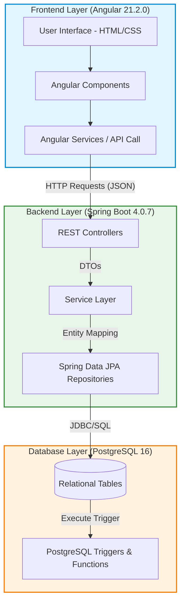
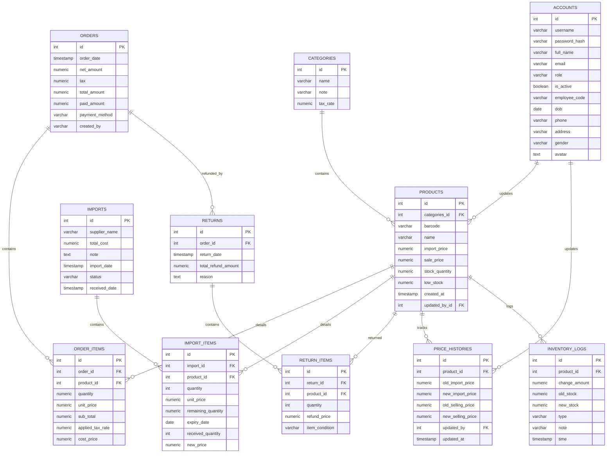
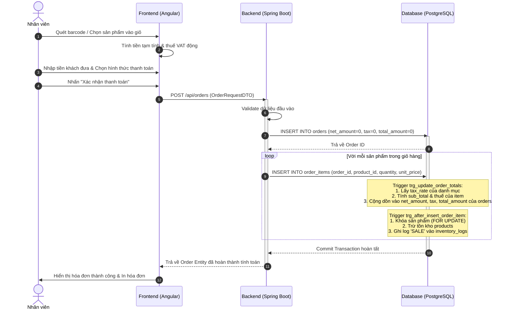
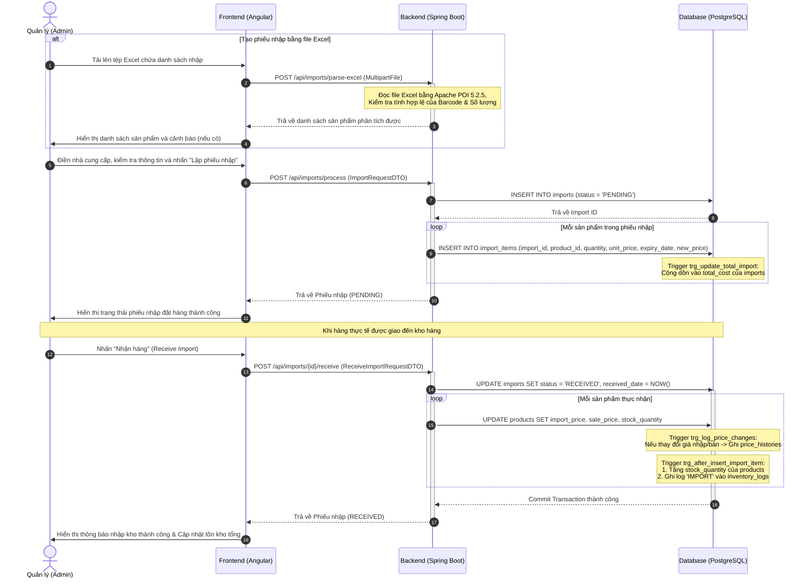
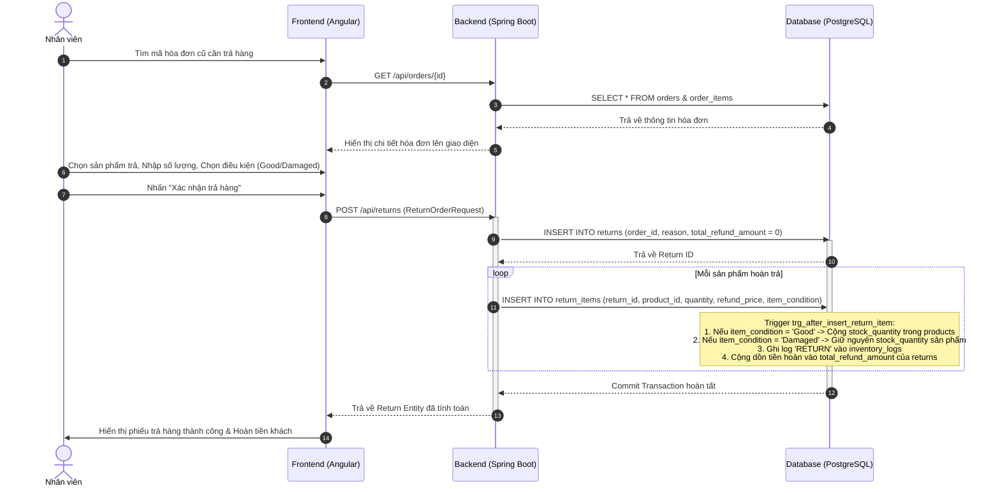

# BÁO CÁO ĐỒ ÁN MÔN HỌC: PROJECT 2
## Đề tài: Hệ thống quản lý bán hàng SmartStore (POS Management System)
**Sinh viên thực hiện:** Dương Gia Huy  
**Mã số sinh viên:** 20236035  
**Trường:** Đại học Bách Khoa Hà Nội  

---

# TÓM TẮT ĐỒ ÁN (ABSTRACT)
Đồ án tập trung nghiên cứu và phát triển hệ thống **SmartStore — POS Management System**, một giải pháp phần mềm quản lý bán hàng tại quầy và quản lý kho toàn diện dành riêng cho các mô hình kinh doanh bán lẻ quy mô vừa và nhỏ. Hệ thống được xây dựng dựa trên kiến trúc phân tách Client-Server 3 lớp (3-tier architecture) hiện đại và độc lập. Trong đó, tầng Frontend sử dụng **Angular Framework 21.2.0** và **TypeScript 5.9.2** để phát triển giao diện đơn trang (Single Page Application) phản hồi nhanh; tầng Backend sử dụng ngôn ngữ **Java 21** kết hợp với **Spring Boot 4.0.7** để xây dựng các RESTful API chuẩn hóa; tầng Database sử dụng hệ quản trị cơ sở dữ liệu quan hệ **PostgreSQL 16**. 

Điểm nhấn kỹ thuật nổi bật của đồ án nằm ở việc **tối ưu hóa hiệu năng dữ liệu trực tiếp tại tầng cơ sở dữ liệu** thông qua lập trình hệ thống Trigger và Stored Procedure. Toàn bộ các nghiệp vụ phức tạp về biến động tồn kho (trừ kho khi bán lẻ, cộng kho khi nhập hàng, hoàn kho có điều kiện lỗi/tốt khi trả hàng), ghi nhận nhật ký kho chi tiết (`inventory_logs`), tính toán tiền thuế VAT động theo từng danh mục, ghi lịch sử thay đổi giá (`price_histories`) và ngăn chặn xóa hóa đơn đều được tự động hóa hoàn toàn bằng trigger của PostgreSQL. Thiết kế này giúp loại bỏ nguy cơ bất đồng bộ dữ liệu (Race Condition) khi có nhiều phiên giao dịch đồng thời và giảm thiểu đáng kể tải xử lý cho Backend.

Phía giao diện Frontend, ứng dụng được tối ưu dung lượng phân phối bằng việc áp dụng kỹ thuật **Custom SVG Path Binding** để tự thiết kế biểu đồ thống kê doanh số động dạng Spline và phân đoạn Donut mà không cần nhúng các thư viện biểu đồ cồng kềnh từ bên thứ ba. Hệ thống cũng tích hợp thư viện **Apache POI 5.2.5** để xử lý đọc/ghi hàng loạt sản phẩm và phiếu nhập từ các tệp tin Excel mẫu một cách nhanh chóng. Đồ án đã được cấu hình API Proxy thông qua tệp `vercel.json` để triển khai thành công trên môi trường đám mây (Vercel cho Frontend và Render cho Backend), vượt qua các kịch bản kiểm thử tích hợp thực tế và sẵn sàng chuyển giao sử dụng.

---

# I. TỔNG QUAN ĐỀ TÀI

## 1.1. Đặt vấn đề (Sự cần thiết của hệ thống quản lý bán hàng POS)
Trong kỷ nguyên số hóa và sự phát triển mạnh mẽ của ngành bán lẻ, các cửa hàng, siêu thị mini và điểm bán lẻ truyền thống đang phải đối mặt với áp lực lớn trong việc nâng cao hiệu quả vận hành và tối ưu hóa trải nghiệm khách hàng. Các phương pháp quản lý bán hàng truyền thống như ghi chép sổ sách thủ công hay sử dụng các bảng tính Excel đơn giản bộc lộ nhiều hạn chế nghiêm trọng:
- **Tốc độ giao dịch chậm:** Việc tính toán tiền hàng, thuế giá trị gia tăng (VAT), và tiền thừa cho khách hàng một cách thủ công tốn nhiều thời gian, dễ gây nhầm lẫn và ùn tắc tại quầy thanh toán vào giờ cao điểm.
- **Thất thoát hàng tồn kho:** Không thể theo dõi biến động kho hàng theo thời gian thực (real-time). Khi hàng hóa được bán ra hoặc nhập thêm, số lượng thực tế trong kho không được cập nhật ngay lập tức dẫn đến tình trạng hết hàng đột ngột hoặc tồn kho quá mức mà quản lý không kịp thời phát hiện.
- **Thiếu kiểm soát lịch sử giá:** Giá bán và giá nhập của các sản phẩm thường xuyên biến động theo thị trường và nhà cung cấp. Việc không lưu lại lịch sử thay đổi giá khiến cửa hàng khó đánh giá biên lợi nhuận và dễ xảy ra tình trạng sai lệch giá bán.
- **Rủi ro thất thoát dữ liệu và gian lận:** Việc nhân viên tự ý xóa sửa hóa đơn đã xuất hoặc điều chỉnh tùy tiện số lượng tồn kho mà không có cơ chế giám sát (nhật ký kho hàng) tạo điều kiện cho các hành vi gian lận tài chính.

Chính vì vậy, việc xây dựng và triển khai một **Hệ thống quản lý bán hàng tại quầy (Point of Sale — POS) tự động hóa, tin cậy và tối ưu** là vô cùng cấp thiết. Hệ thống này không chỉ chuẩn hóa quy trình thanh toán mà còn là công cụ giúp quản lý cửa hàng kiểm soát chặt chẽ toàn bộ vòng đời của sản phẩm từ khâu nhập kho, điều chỉnh giá, bán hàng, cho đến hoàn trả hàng lỗi.

## 1.2. Mục tiêu đề tài (SmartStore POS Management System)
Đề tài nghiên cứu và xây dựng hệ thống **SmartStore POS Management System** nhằm giải quyết triệt để các thách thức trong quản lý bán lẻ thông qua các mục tiêu cụ thể sau:
- **Tự động hóa quy trình bán hàng tại quầy:** Xây dựng giao diện POS trực quan, cho phép nhân viên quét mã vạch sản phẩm, tự động tính toán tổng tiền, áp dụng thuế suất VAT động (8% hoặc 10% tùy danh mục sản phẩm) và tự động tính tiền thối lại cho khách dựa trên phương thức thanh toán linh hoạt (Tiền mặt, Thẻ, Chuyển khoản QR).
- **Kiểm soát tồn kho theo thời gian thực (Real-time Inventory control):** Thiết kế cơ chế tự động trừ kho khi bán hàng, cộng kho khi nhập hàng, và xử lý hoàn trả kho có điều kiện đối với hàng lỗi/hỏng hoặc hàng còn tốt thông qua các nghiệp vụ lưu trữ đồng bộ.
- **Đảm bảo tính toàn vẹn dữ liệu và an toàn hệ thống:** Xây dựng cơ chế lưu vết lịch sử biến động giá (`price_histories`), lưu nhật ký kho chi tiết (`inventory_logs`) và ngăn chặn triệt để hành vi xóa hóa đơn trực tiếp từ phía người dùng nhằm chống thất thoát tài chính.
- **Quản lý nhập hàng khoa học:** Hỗ trợ tạo phiếu nhập kho từ nhiều nhà cung cấp, cho phép điều chỉnh giá bán trực tiếp ngay tại thời điểm nhập hàng để cập nhật kịp thời xu hướng thị trường.
- **Thống kê báo cáo trực quan:** Cung cấp các công cụ báo cáo doanh thu, chi phí nhập hàng, và lợi nhuận thực tế theo khoảng thời gian bằng cách trực quan hóa dữ liệu qua biểu đồ động.

## 1.3. Phạm vi nghiên cứu và đối tượng áp dụng
- **Phạm vi nghiên cứu:** 
  - Đề tài tập trung nghiên cứu kiến trúc ứng dụng Web 3 lớp phân tách rõ ràng (Client-Server).
  - Trọng tâm kỹ thuật đặt vào việc **tối ưu hóa hiệu năng nghiệp vụ dữ liệu bằng cách lập trình trực tiếp các Trigger và Database Functions trên PostgreSQL**. Việc này giúp hệ thống tự động hóa các nghiệp vụ tính toán tiền, ghi log lịch sử giá và thay đổi tồn kho trực tiếp tại tầng CSDL mà không phụ thuộc hoàn toàn vào logic xử lý của ứng dụng Backend.
  - Xây dựng giao diện Single Page Application (SPA) phản hồi nhanh bằng Angular và kết nối API RESTful thông qua tầng trung gian Spring Boot.
- **Đối tượng áp dụng:**
  - Hệ thống được thiết kế tối ưu cho các cửa hàng bán lẻ quy mô vừa và nhỏ (siêu thị mini, cửa hàng tạp hóa, shop thời trang, cửa hàng tiện lợi) có nhu cầu quản lý bán hàng tập trung tại một cửa hàng (Single-Store).
  - Đối tượng sử dụng trực tiếp bao gồm Nhân viên bán hàng tại quầy (Staff) thực hiện nghiệp vụ thanh toán và Admin/Quản lý cửa hàng thực hiện kiểm soát kho, lập phiếu nhập và theo dõi báo cáo doanh thu.

---

# II. CƠ SỞ LÝ THUYẾT VÀ CÔNG NGHỆ SỬ DỤNG

*Bảng 2.1 - Các phiên bản công nghệ sử dụng thực tế trong dự án SmartStore*

| Thành phần | Công nghệ / Thư viện | Phiên bản thực tế trong dự án | Vai trò trong hệ thống |
|---|---|---|---|
| **Frontend** | Angular Framework | 21.2.0 | Xây dựng giao diện Single Page Application (SPA), quản lý luồng dữ liệu và định tuyến |
| **Frontend** | TypeScript | 5.9.2 | Ngôn ngữ lập trình chính cho Frontend với hệ thống kiểm soát kiểu dữ liệu tĩnh |
| **Frontend** | RxJS | 7.8.0 | Xử lý các luồng sự kiện bất đồng bộ và tối ưu tương tác API |
| **Backend** | Java | 21 (LTS) | Nền tảng thực thi ứng dụng phía Server |
| **Backend** | Spring Boot | 4.0.7 | Framework phát triển Backend RESTful API, quản lý Dependency Injection và cấu hình tự động |
| **Backend** | Spring Data JPA (Hibernate) | Tích hợp sẵn | Truy cập và ánh xạ dữ liệu quan hệ (ORM) sang đối tượng Java |
| **Backend** | Apache POI | 5.2.5 | Đọc và xử lý tệp tin Excel phục vụ nghiệp vụ nhập hàng loạt |
| **Database** | PostgreSQL | PostgreSQL Dialect | Hệ quản trị cơ sở dữ liệu quan hệ lưu trữ dữ liệu và xử lý nghiệp vụ qua Trigger |

## 2.1. Kiến trúc hệ thống Client-Server (RESTful API Web Application)
Hệ thống SmartStore tuân thủ mô hình kiến trúc 3 lớp (3-tier architecture) tiêu chuẩn, cho phép phân tách độc lập giữa giao diện người dùng, logic xử lý nghiệp vụ và lưu trữ dữ liệu:


*Hình 2.1 - Sơ đồ kiến trúc 3 lớp của hệ thống SmartStore POS*

Sự tương tác giữa các lớp được thực hiện thông qua giao thức truyền tải siêu văn bản HTTP/HTTPS bằng kiến trúc **RESTful API**:
1. **Presentation Layer (Client - Angular):** Đảm nhận nhiệm vụ dựng giao diện người dùng động, tiếp nhận các tương tác và gửi yêu cầu (Request) bất đồng bộ dưới dạng định dạng JSON tới Backend. Lớp này không thực hiện trực tiếp các tính toán nghiệp vụ hay truy cập cơ sở dữ liệu để đảm bảo tính bảo mật và nhẹ nhàng cho trình duyệt.
2. **Application Layer (Server - Spring Boot):** Đóng vai trò là cổng tiếp nhận API (API Gate), thực hiện kiểm tra tính hợp lệ dữ liệu (Validation), điều phối luồng xử lý và giao tiếp với cơ sở dữ liệu thông qua Spring Data JPA.
3. **Database Layer (PostgreSQL):** Không chỉ lưu trữ dữ liệu dạng bảng quan hệ, lớp này còn tích hợp trực tiếp logic nghiệp vụ xử lý dữ liệu nặng thông qua **Trigger và Function**. Các phép tính toán tổng tiền hóa đơn, cập nhật số lượng tồn kho và ghi log lịch sử được thực thi trực tiếp tại đây giúp loại bỏ nguy cơ bất đồng bộ dữ liệu khi có nhiều giao dịch diễn ra đồng thời.

## 2.2. Công nghệ phía Frontend (Angular 21 & TypeScript)
Trái với các thiết kế sử dụng thư viện đơn lẻ như React hay Vue đòi hỏi tích hợp nhiều công cụ bên thứ ba, dự án lựa chọn **Angular** làm nền tảng phát triển phía Client. Thực tế trong cấu hình `package.json` của dự án, các phiên bản công nghệ được áp dụng bao gồm:
- **Angular Framework (Phiên bản 21.2.0):** Cung cấp giải pháp toàn diện (All-in-one) để xây dựng ứng dụng SPA chất lượng cao. Cơ chế định tuyến (`@angular/router`) giúp chuyển trang mượt mà không cần tải lại toàn bộ trang. Cơ chế quản lý form mạnh mẽ (`@angular/forms`) hỗ trợ theo dõi trạng thái nhập liệu của nhân viên tại quầy theo thời gian thực.
- **TypeScript (Phiên bản 5.9.2):** Là một siêu ngôn ngữ (superset) của JavaScript, bổ sung cơ chế kiểm soát kiểu dữ liệu tĩnh (Strong Typing). TypeScript giúp phát hiện các lỗi logic ngay trong quá trình biên dịch (Compile-time), cải thiện chất lượng code và hỗ trợ đắc lực cho việc định nghĩa các interface dữ liệu trao đổi với Backend.
- **RxJS (Reactive Extensions for JavaScript - Phiên bản 7.8.0):** Cung cấp các Observable giúp xử lý các sự kiện bất đồng bộ như gọi API, bắt sự kiện nhập liệu tìm kiếm sản phẩm theo thời gian thực (debounce time) một cách mượt mà và tối ưu hóa hiệu năng.

## 2.3. Công nghệ phía Backend (Java & Spring Boot 3 / Thực tế Java 21 & Spring Boot 4.0.7)
Mã nguồn phía Backend của hệ thống được tổ chức dựa trên hệ sinh thái Java hiện đại, cụ thể cấu hình tệp `pom.xml` sử dụng các công nghệ:
- **Java 21:** Phiên bản hỗ trợ dài hạn (LTS) mang lại nhiều cải tiến về hiệu năng bộ nhớ, các cấu trúc ngôn ngữ mới giúp viết mã nguồn ngắn gọn và tối ưu hóa luồng xử lý.
- **Spring Boot (Phiên bản 4.0.7):** Cung cấp bộ khung ứng dụng Backend mạnh mẽ với các starter dependencies giúp giảm thiểu tối đa việc cấu hình thủ công:
  - `spring-boot-starter-webmvc`: Hỗ trợ xây dựng các API RESTful theo mô hình MVC, định tuyến các endpoint và chuyển đổi dữ liệu tự động giữa Java Object và JSON.
  - `spring-boot-starter-data-jpa`: Tích hợp Hibernate giúp ánh xạ đối tượng xuống cơ sở dữ liệu quan hệ (ORM) và cung cấp các hàm truy vấn dữ liệu chuẩn mà không cần viết các câu lệnh SQL thuần túy phức tạp.
  - `spring-boot-starter-validation`: Thực hiện kiểm tra ràng buộc dữ liệu đầu vào (ví dụ kiểm tra số lượng sản phẩm nhập phải lớn hơn 0, barcode không được để trống) ngay tại tầng Controller.
- **Apache POI (Phiên bản 5.2.5):** Thư viện hỗ trợ đọc và ghi các định dạng tệp tin của Microsoft Office. Trong dự án này, Apache POI đóng vai trò quan trọng trong việc phân tích các tệp tin Excel nhập hàng hàng loạt (được minh chứng qua tệp mẫu `test_200_rows.xlsx` chứa dữ liệu sản phẩm mẫu).
- **Lombok:** Công cụ hỗ trợ tạo tự động các hàm Getter, Setter, Constructor, Builder thông qua Annotation, giúp mã nguồn Java sạch sẽ và dễ bảo trì.

## 2.4. Hệ quản trị cơ sở dữ liệu (PostgreSQL 16)
Dự án sử dụng hệ quản trị cơ sở dữ liệu quan hệ mã nguồn mở **PostgreSQL** để lưu trữ và vận hành dữ liệu. 
- **Cấu hình kết nối:** Được thiết lập trong tệp `application.properties` kết nối qua Driver `org.postgresql.Driver` tới cơ sở dữ liệu `project2_db`.
- **Cơ chế đồng bộ hóa:** Dự án cấu hình thuộc tính `spring.jpa.hibernate.ddl-auto=none` nhằm ngăn Hibernate tự động can thiệp sửa đổi cấu trúc bảng, đảm bảo cấu trúc database được quản lý và khởi tạo hoàn toàn thông qua tệp [database.sql](file:///d:/Hust/project.2/database.sql) bằng thuộc tính `spring.sql.init.schema-locations=file:database.sql`.
- **Vai trò đặc biệt của PostgreSQL trong dự án:**
  - Thay vì xử lý toàn bộ logic nghiệp vụ cập nhật tồn kho ở tầng Java (dễ dẫn đến lỗi tranh chấp dữ liệu khi nhiều luồng cùng truy cập - Race Condition), dự án đã chuyển dịch toàn bộ logic này xuống PostgreSQL thông qua việc sử dụng **Trigger** kết hợp với từ khóa **FOR UPDATE** để khóa dòng dữ liệu sản phẩm đang giao dịch.
  - Hỗ trợ cơ chế tự động hóa nghiệp vụ: Khi một bản ghi được chèn vào bảng `order_items` hay `import_items`, hệ thống trigger tương ứng trên PostgreSQL sẽ tự động tính toán tổng tiền, tính thuế VAT dựa trên quan hệ giữa bảng `products` và `categories`, cập nhật số lượng tồn kho của sản phẩm, đồng thời ghi lại nhật ký thay đổi tồn kho (`inventory_logs`) mà không cần bất kỳ lệnh SQL bổ sung nào từ Backend Spring Boot.

---

# III. PHÂN TÍCH VÀ THIẾT KẾ HỆ THỐNG

## 3.1. Phân tích yêu cầu chức năng (Sơ đồ Use Case tổng quan và đặc tả chi tiết)

Hệ thống có hai tác nhân chính là **Quản trị viên (Admin)** và **Nhân viên bán hàng (Staff)**. 

```mermaid
usecaseDiagram
    actor Admin
    actor Staff
    
    rect System_Boundary ["SmartStore POS Boundary"]
        usecase UC001_Login ["UC001: Đăng nhập"]
        usecase UC002_POS ["UC002: Bán hàng tại quầy"]
        usecase UC003_Return ["UC003: Trả hàng"]
        usecase UC004_ViewInv ["UC004: Tra cứu tồn kho"]
        usecase UC005_ViewTrans ["UC005: Xem lịch sử giao dịch"]
        usecase UC006_ManageEmp ["UC006: Quản lý nhân sự"]
        usecase UC007_ManageProd ["UC007: Quản lý sản phẩm"]
        usecase UC008_ManageCat ["UC008: Quản lý danh mục"]
        usecase UC009_Import ["UC009: Nhập hàng từ Excel/Thủ công"]
        usecase UC010_ViewRep ["UC010: Xem báo cáo doanh thu"]
    end

    Admin --> UC001_Login
    Admin --> UC002_POS
    Admin --> UC003_Return
    Admin --> UC004_ViewInv
    Admin --> UC005_ViewTrans
    Admin --> UC006_ManageEmp
    Admin --> UC007_ManageProd
    Admin --> UC008_ManageCat
    Admin --> UC009_Import
    Admin --> UC010_ViewRep

    Staff --> UC001_Login
    Staff --> UC002_POS
    Staff --> UC003_Return
    Staff --> UC004_ViewInv
    Staff --> UC005_ViewTrans
```
*Hình 3.1 - Sơ đồ Use Case tổng quan hệ thống SmartStore*

### Đặc tả chi tiết ca sử dụng cốt lõi:

*Bảng 3.1 - Đặc tả ca sử dụng UC002: Bán hàng tại quầy (POS Checkout)*

| Thành phần đặc tả | Nội dung chi tiết |
|---|---|
| **Tên ca sử dụng** | UC002: Bán hàng tại quầy (POS Checkout) |
| **Tác nhân** | Nhân viên bán hàng (Staff), Quản trị viên (Admin) |
| **Mô tả ngắn** | Nhân viên thực hiện quét barcode/chọn sản phẩm, tự động tính tổng tiền, thuế VAT, tiền thừa và xuất hóa đơn. |
| **Điều kiện tiên quyết** | Nhân viên đã đăng nhập thành công vào hệ thống. |
| **Luồng sự kiện chính** | 1. Nhân viên tìm kiếm sản phẩm hoặc quét mã vạch sản phẩm để thêm vào giỏ hàng.<br>2. Hệ thống truy vấn thông tin sản phẩm và tự động điền đơn giá, tính thuế VAT dựa trên danh mục.<br>3. Nhân viên điều chỉnh số lượng sản phẩm.<br>4. Hệ thống cập nhật tổng tiền cần thanh toán.<br>5. Nhân viên chọn phương thức thanh toán (Tiền mặt/Thẻ/QR). Nhập số tiền nhận từ khách.<br>6. Hệ thống tự động tính tiền thừa và nhân viên nhấn nút xác nhận.<br>7. Hệ thống ghi nhận hóa đơn mới và kích hoạt trigger tự động trừ kho hàng. |
| **Điều kiện sau** | Số lượng tồn kho được cập nhật chính xác, hóa đơn được ghi nhận vào hệ thống. |

*Bảng 3.2 - Đặc tả ca sử dụng UC009: Nhập hàng (Import)*

| Thành phần đặc tả | Nội dung chi tiết |
|---|---|
| **Tên ca sử dụng** | UC009: Nhập hàng |
| **Tác nhân** | Quản trị viên (Admin) |
| **Mô tả ngắn** | Admin tạo phiếu nhập kho (thủ công hoặc nhập hàng loạt từ tệp Excel), cập nhật giá nhập/bán và số lượng tồn kho của các sản phẩm. |
| **Điều kiện tiên quyết** | Tài khoản có quyền Admin và các sản phẩm đã được khai báo trên hệ thống. |
| **Luồng sự kiện chính** | 1. Admin truy cập màn hình Nhập hàng và chọn hình thức tạo phiếu nhập (chọn sản phẩm thủ công hoặc tải lên tệp Excel).<br>2. Admin điền thông tin nhà cung cấp, số lượng nhập, giá nhập và giá bán mới.<br>3. Admin gửi yêu cầu xác nhận lưu phiếu nhập ở trạng thái PENDING.<br>4. Khi hàng về kho thực tế, Admin kiểm tra số lượng và bấm xác nhận nhận hàng (RECEIVE).<br>5. Hệ thống cập nhật trạng thái phiếu nhập thành RECEIVED, tăng tồn kho sản phẩm tương ứng và lưu lịch sử thay đổi giá nếu có. |
| **Điều kiện sau** | Tồn kho sản phẩm được cộng thêm tương ứng, tệp nhật ký kho và lịch sử giá được cập nhật. |

*Bảng 3.3 - Đặc tả ca sử dụng UC003: Xử lý hoàn trả hàng (Return Item)*

| Thành phần đặc tả | Nội dung chi tiết |
|---|---|
| **Tên ca sử dụng** | UC003: Xử lý hoàn trả hàng (Return Item) |
| **Tác nhân** | Nhân viên bán hàng (Staff), Quản trị viên (Admin) |
| **Mô tả ngắn** | Nhân viên thực hiện hoàn trả hàng cho khách từ hóa đơn cũ, hệ thống tự động cộng kho có điều kiện (hàng còn tốt/hàng hỏng) và tính tổng hoàn tiền. |
| **Điều kiện tiên quyết** | Hóa đơn bán hàng cũ tồn tại trong hệ thống. |
| **Luồng sự kiện chính** | 1. Nhân viên tìm kiếm hóa đơn gốc dựa trên mã hóa đơn.<br>2. Hệ thống hiển thị chi tiết hóa đơn cũ.<br>3. Nhân viên chọn sản phẩm hoàn trả, nhập số lượng trả, giá hoàn tiền và chọn trạng thái hàng hóa (Hàng còn tốt - Good / Hàng bị lỗi, hỏng - Damaged).<br>4. Hệ thống tự động kiểm tra số lượng trả phải nhỏ hơn hoặc bằng số lượng mua.<br>5. Nhân viên xác nhận hoàn trả.<br>6. Hệ thống tạo phiếu trả hàng, nếu hàng còn tốt (Good) thì cộng lại vào kho thực tế, nếu hỏng (Damaged) thì giữ nguyên kho, đồng thời tự động cập nhật tổng tiền hoàn. |
| **Điều kiện sau** | Phiếu trả hàng được ghi nhận, tồn kho thay đổi tương ứng theo tình trạng sản phẩm. |

## 3.2. Thiết kế Cơ sở dữ liệu (Sơ đồ thực thể liên kết ERD và mô tả chi tiết các bảng)

Mối quan hệ giữa các bảng dữ liệu trong cơ sở dữ liệu `project2_db` được thể hiện qua sơ đồ thực thể liên kết (ERD) dưới đây:


*Hình 3.2 - Sơ đồ thực thể liên kết ERD của hệ thống SmartStore*

### Mô tả chi tiết các bảng dữ liệu:

*Bảng 3.4 - Cấu trúc bảng accounts (Tài khoản người dùng)*

| Tên cột | Kiểu dữ liệu | Ràng buộc | Mô tả |
|---|---|---|---|
| `id` | SERIAL | PRIMARY KEY | Khóa chính tự tăng |
| `username` | VARCHAR(50) | UNIQUE, NOT NULL | Tên đăng nhập |
| `password_hash` | TEXT | NOT NULL | Mật khẩu mã hóa |
| `full_name` | VARCHAR(100) | NOT NULL | Họ và tên |
| `email` | VARCHAR(100) | UNIQUE | Địa chỉ email |
| `role` | VARCHAR(20) | DEFAULT 'staff' | Vai trò (admin/staff) |
| `is_active` | BOOLEAN | DEFAULT TRUE | Trạng thái hoạt động |
| `employee_code` | VARCHAR(50) | UNIQUE | Mã số nhân viên |
| `dob` | DATE | | Ngày sinh |
| `phone` | VARCHAR(20) | | Số điện thoại |
| `address` | VARCHAR(255) | | Địa chỉ |
| `gender` | VARCHAR(20) | | Giới tính |
| `avatar` | TEXT | | Đường dẫn ảnh đại diện |

*Bảng 3.5 - Cấu trúc bảng categories (Danh mục sản phẩm)*

| Tên cột | Kiểu dữ liệu | Ràng buộc | Mô tả |
|---|---|---|---|
| `id` | SERIAL | PRIMARY KEY | Khóa chính tự tăng |
| `name` | VARCHAR(100) | UNIQUE, NOT NULL | Tên danh mục |
| `note` | VARCHAR(255) | | Ghi chú |
| `tax_rate` | NUMERIC | DEFAULT 0.08 | Thuế suất áp dụng (ví dụ 0.08 hoặc 0.10) |

*Bảng 3.6 - Cấu trúc bảng products (Thông tin sản phẩm)*

| Tên cột | Kiểu dữ liệu | Ràng buộc | Mô tả |
|---|---|---|---|
| `id` | SERIAL | PRIMARY KEY | Khóa chính tự tăng |
| `categories_id` | INTEGER | FK (categories.id) | Khóa ngoại danh mục sản phẩm |
| `barcode` | VARCHAR(50) | UNIQUE, NOT NULL | Mã vạch sản phẩm |
| `name` | VARCHAR(255) | NOT NULL | Tên sản phẩm |
| `import_price` | NUMERIC | NOT NULL, >= 0 | Giá nhập hàng hiện tại |
| `sale_price` | NUMERIC | NOT NULL, >= 0 | Giá bán ra hiện tại |
| `stock_quantity` | NUMERIC | DEFAULT 0 | Số lượng tồn kho thực tế |
| `low_stock` | NUMERIC | DEFAULT 10 | Ngưỡng cảnh báo tồn kho thấp |
| `created_at` | TIMESTAMPTZ | | Ngày giờ tạo |
| `updated_by_id` | INTEGER | FK (accounts.id) | Người cập nhật gần nhất |

*Bảng 3.7 - Cấu trúc bảng orders (Hóa đơn bán hàng)*

| Tên cột | Kiểu dữ liệu | Ràng buộc | Mô tả |
|---|---|---|---|
| `id` | SERIAL | PRIMARY KEY | Khóa chính tự tăng |
| `order_date` | TIMESTAMPTZ | | Ngày giờ lập hóa đơn |
| `net_amount` | NUMERIC | DEFAULT 0, >= 0 | Tổng tiền hàng chưa thuế |
| `tax` | NUMERIC | DEFAULT 0, >= 0 | Tổng tiền thuế VAT |
| `total_amount` | NUMERIC | DEFAULT 0, >= 0 | Tổng giá trị hóa đơn (tiền thanh toán) |
| `paid_amount` | NUMERIC | DEFAULT 0 | Số tiền khách đã trả |
| `payment_method` | VARCHAR(50) | | Phương thức (Cash/Card/QR) |
| `created_by` | VARCHAR(50) | | Tên và mã nhân viên lập hóa đơn |

*Bảng 3.8 - Cấu trúc bảng order_items (Chi tiết hóa đơn)*

| Tên cột | Kiểu dữ liệu | Ràng buộc | Mô tả |
|---|---|---|---|
| `id` | SERIAL | PRIMARY KEY | Khóa chính tự tăng |
| `order_id` | INTEGER | FK (orders.id) ON DELETE CASCADE | Khóa ngoại hóa đơn |
| `product_id` | INTEGER | FK (products.id) | Khóa ngoại sản phẩm |
| `quantity` | NUMERIC | NOT NULL, > 0 | Số lượng bán |
| `unit_price` | NUMERIC | NOT NULL, >= 0 | Đơn giá bán tại thời điểm mua |
| `sub_total` | NUMERIC | | Tiền hàng chưa thuế (Qty * Price) |
| `applied_tax_rate`| NUMERIC | | Mức thuế suất áp dụng tại thời điểm bán |
| `cost_price` | NUMERIC(15,2) | | Giá nhập gốc sản phẩm tại thời điểm bán |

*Bảng 3.9 - Cấu trúc bảng imports (Phiếu nhập kho)*

| Tên cột | Kiểu dữ liệu | Ràng buộc | Mô tả |
|---|---|---|---|
| `id` | SERIAL | PRIMARY KEY | Khóa chính tự tăng |
| `supplier_name` | VARCHAR(255) | | Tên nhà cung cấp |
| `total_cost` | NUMERIC | DEFAULT 0 | Tổng chi phí nhập hàng |
| `note` | TEXT | | Ghi chú phiếu nhập |
| `import_date` | TIMESTAMPTZ | DEFAULT NOW() | Ngày tạo phiếu nhập |
| `status` | VARCHAR(50) | DEFAULT 'PENDING' | Trạng thái (PENDING/RECEIVED/CANCELLED) |
| `received_date` | TIMESTAMPTZ | | Ngày thực nhận hàng về kho |

*Bảng 3.10 - Cấu trúc bảng import_items (Chi tiết phiếu nhập)*

| Tên cột | Kiểu dữ liệu | Ràng buộc | Mô tả |
|---|---|---|---|
| `id` | SERIAL | PRIMARY KEY | Khóa chính tự tăng |
| `import_id` | INTEGER | FK (imports.id) ON DELETE CASCADE | Khóa ngoại phiếu nhập |
| `product_id` | INTEGER | FK (products.id) | Khóa ngoại sản phẩm |
| `quantity` | INTEGER | NOT NULL | Số lượng đặt hàng |
| `unit_price` | NUMERIC(15,2) | NOT NULL | Giá nhập hàng dự kiến |
| `remaining_quantity`| NUMERIC(15,2)| | Số lượng còn lại trong lô (quản lý FEFO) |
| `expiry_date` | DATE | | Hạn sử dụng của sản phẩm trong lô |
| `received_quantity`| INTEGER | DEFAULT 0 | Số lượng hàng thực nhận |
| `new_price` | NUMERIC(15,2) | | Giá bán mới áp dụng sau khi nhập |

*Bảng 3.11 - Cấu trúc bảng returns (Phiếu hoàn trả)*

| Tên cột | Kiểu dữ liệu | Ràng buộc | Mô tả |
|---|---|---|---|
| `id` | SERIAL | PRIMARY KEY | Khóa chính tự tăng |
| `order_id` | INTEGER | FK (orders.id) ON DELETE SET NULL | Khóa ngoại hóa đơn liên quan |
| `return_date` | TIMESTAMPTZ | DEFAULT NOW() | Ngày giờ lập phiếu trả |
| `total_refund_amount`| NUMERIC(15,2)| DEFAULT 0 | Tổng tiền hoàn lại cho khách |
| `reason` | TEXT | | Lý do trả hàng |

*Bảng 3.12 - Cấu trúc bảng return_items (Chi tiết hoàn trả)*

| Tên cột | Kiểu dữ liệu | Ràng buộc | Mô tả |
|---|---|---|---|
| `id` | SERIAL | PRIMARY KEY | Khóa chính tự tăng |
| `return_id` | INTEGER | FK (returns.id) ON DELETE CASCADE | Khóa ngoại phiếu trả |
| `product_id` | INTEGER | FK (products.id) | Khóa ngoại sản phẩm trả |
| `quantity` | INTEGER | NOT NULL, > 0 | Số lượng trả |
| `refund_price` | NUMERIC(15,2) | NOT NULL | Giá hoàn trả cho một đơn vị |
| `item_condition` | VARCHAR(100) | DEFAULT 'Good' | Tình trạng hàng (Good/Damaged) |

*Bảng 3.13 - Cấu trúc bảng price_histories (Lịch sử biến động giá)*

| Tên cột | Kiểu dữ liệu | Ràng buộc | Mô tả |
|---|---|---|---|
| `id` | SERIAL | PRIMARY KEY | Khóa chính tự tăng |
| `product_id` | INTEGER | FK (products.id) ON DELETE CASCADE | Khóa ngoại sản phẩm |
| `old_import_price`| NUMERIC(12,2) | | Giá nhập trước khi thay đổi |
| `new_import_price`| NUMERIC(12,2) | | Giá nhập sau khi thay đổi |
| `old_selling_price`| NUMERIC(12,2) | | Giá bán trước khi thay đổi |
| `new_selling_price`| NUMERIC(12,2) | | Giá bán sau khi thay đổi |
| `updated_by` | INTEGER | FK (accounts.id) ON DELETE RESTRICT| Người thực hiện cập nhật giá |
| `updated_at` | TIMESTAMP | DEFAULT NOW() | Ngày giờ cập nhật |

*Bảng 3.14 - Cấu trúc bảng inventory_logs (Nhật ký kho hàng)*

| Tên cột | Kiểu dữ liệu | Ràng buộc | Mô tả |
|---|---|---|---|
| `id` | SERIAL | PRIMARY KEY | Khóa chính tự tăng |
| `product_id` | INTEGER | FK (products.id) | Khóa ngoại sản phẩm |
| `change_amount` | NUMERIC | NOT NULL | Lượng thay đổi tồn kho (âm nếu xuất, dương nếu nhập) |
| `old_stock` | NUMERIC | NOT NULL | Số lượng tồn kho trước khi thay đổi |
| `new_stock` | NUMERIC | NOT NULL | Số lượng tồn kho sau khi thay đổi |
| `type` | VARCHAR(50) | | Lý do biến động (SALE, IMPORT, RETURN) |
| `note` | VARCHAR(200) | | Mô tả chi tiết (ví dụ mã hóa đơn, mã phiếu nhập) |
| `time` | TIMESTAMPTZ | DEFAULT NOW() | Ngày giờ ghi nhận nhật ký |

## 3.3. Thiết kế nghiệp vụ mức CSDL bằng PostgreSQL Triggers và Functions (Điểm nhấn kỹ thuật)

Để đảm bảo tính toàn vẹn dữ liệu ở mức cao nhất, hạn chế xung đột luồng và tối ưu hóa hiệu năng hệ thống, toàn bộ các nghiệp vụ liên quan đến biến động tồn kho, tính toán thuế hóa đơn và ghi nhật ký lịch sử được thực hiện tự động bằng Trigger và Function trong PostgreSQL.

### 3.3.1. Tự động cập nhật tồn kho và ghi nhật ký kho khi bán hàng
Khi chèn một dòng chi tiết bán hàng vào bảng `order_items`, Trigger `trg_after_insert_order_item` sẽ gọi hàm `update_stock_and_log_sale()` để xử lý:
- Sử dụng mệnh đề `FOR UPDATE` để khóa dòng sản phẩm, tránh lỗi tranh chấp tài nguyên (Race Condition) khi có nhiều nhân viên cùng bán một sản phẩm.
- Tính toán số lượng tồn kho mới và cập nhật trực tiếp vào bảng `products`.
- Ghi nhận lịch sử chi tiết vào bảng `inventory_logs` dưới dạng lượng thay đổi âm.

*(Hàm trích dẫn thực tế)*:
```sql
CREATE FUNCTION public.update_stock_and_log_sale() RETURNS trigger
    LANGUAGE plpgsql
    AS $$
DECLARE
    v_old_stock numeric;
    v_new_stock numeric;
BEGIN
    -- 1. Lấy số lượng tồn kho hiện tại và khóa dòng đó để tránh tranh chấp (Race condition)
    SELECT stock_quantity INTO v_old_stock 
    FROM public.products 
    WHERE id = NEW.product_id 
    FOR UPDATE;

    -- 2. Tính toán số lượng mới
    v_new_stock := v_old_stock - NEW.quantity;

    -- 3. Cập nhật số lượng mới vào bảng products
    UPDATE public.products 
    SET stock_quantity = v_new_stock 
    WHERE id = NEW.product_id;

    -- 4. Ghi nhật ký chi tiết vào inventory_logs
    INSERT INTO public.inventory_logs (
        product_id, change_amount, old_stock, new_stock, type, note, time
    )
    VALUES (
        NEW.product_id, -NEW.quantity, v_old_stock, v_new_stock, 'SALE', 'Hóa đơn ID: ' || NEW.order_id, CURRENT_TIMESTAMP
    );

    RETURN NEW;
END;
$$;
```

### 3.3.2. Tự động tính toán tổng tiền và thuế VAT của hóa đơn bán hàng
Trigger `trg_update_order_totals` được kích hoạt `BEFORE INSERT` trên bảng `order_items` để gọi hàm `update_order_amounts_final()`:
- Tự động lấy mức thuế suất `tax_rate` bằng cách liên kết sản phẩm (`product_id`) với danh mục tương ứng.
- Gán mức thuế suất tại thời điểm bán vào dòng chi tiết hóa đơn (`applied_tax_rate`).
- Tính tiền hàng chưa thuế (`sub_total := quantity * unit_price`).
- Tính thuế tương ứng cho mặt hàng này (`sub_total * tax_rate`).
- Cập nhật cộng dồn các giá trị này vào bảng `orders` (net_amount, tax, total_amount).

*(Hàm trích dẫn thực tế)*:
```sql
CREATE FUNCTION public.update_order_amounts_final() RETURNS trigger
    LANGUAGE plpgsql
    AS $$
DECLARE
    v_tax_rate numeric;
    v_item_tax numeric;
BEGIN
    -- 1. Lấy mức thuế suất bằng cách nối từ Product sang Category
    SELECT c.tax_rate INTO v_tax_rate 
    FROM public.products p
    JOIN public.categories c ON p.categories_id = c.id
    WHERE p.id = NEW.product_id;

    v_tax_rate := COALESCE(v_tax_rate, 0);

    -- 2. Gán mức thuế tại thời điểm bán vào dòng chi tiết hóa đơn
    NEW.applied_tax_rate := v_tax_rate;

    -- 3. Tính tiền hàng chưa thuế cho món này (Số lượng * Đơn giá)
    NEW.sub_total := NEW.quantity * NEW.unit_price;
    
    -- 4. Tính tiền thuế riêng cho món hàng này
    v_item_tax := NEW.sub_total * v_tax_rate;

    -- 5. Cập nhật tổng số tiền vào bảng orders (đầu hóa đơn)
    UPDATE public.orders
    SET 
        net_amount = net_amount + NEW.sub_total,
        tax = tax + v_item_tax,
        total_amount = total_amount + (NEW.sub_total + v_item_tax)
    WHERE id = NEW.order_id;

    RETURN NEW; 
END;
$$;
```

### 3.3.3. Tự động hoàn kho có điều kiện khi xử lý trả hàng
Khi khách hàng trả lại sản phẩm, Trigger `trg_after_insert_return_item` chạy hàm `update_stock_and_log_return()` xử lý hoàn trả có điều kiện:
- Nếu sản phẩm còn tốt (`item_condition = 'Good'`), hệ thống cộng lại số lượng vào tồn kho thực tế của bảng `products`.
- Nếu sản phẩm bị hư hỏng (`item_condition = 'Damaged'`), số lượng tồn kho thực tế giữ nguyên để tránh việc bán nhầm hàng lỗi ra thị trường.
- Ghi nhật ký vào bảng `inventory_logs` với lý do `RETURN`.
- Tự động tính tiền hoàn lại (`NEW.quantity * NEW.refund_price`) và cộng dồn vào cột `total_refund_amount` của bảng `returns`.

*(Hàm trích dẫn thực tế)*:
```sql
CREATE FUNCTION public.update_stock_and_log_return() RETURNS trigger
    LANGUAGE plpgsql
    AS $$
DECLARE
    v_old_stock numeric;
    v_new_stock numeric;
BEGIN
    -- 1. Lấy số lượng tồn kho hiện tại của sản phẩm và khóa dòng
    SELECT stock_quantity INTO v_old_stock 
    FROM public.products 
    WHERE id = NEW.product_id 
    FOR UPDATE;

    -- 2. Logic cộng kho: Chỉ cộng lại nếu hàng còn tốt (Good)
    IF NEW.item_condition = 'Good' THEN
        v_new_stock := v_old_stock + NEW.quantity;
        UPDATE public.products SET stock_quantity = v_new_stock WHERE id = NEW.product_id;
    ELSE
        v_new_stock := v_old_stock; 
    END IF;

    -- 3. Ghi nhật ký kho (inventory_logs)
    INSERT INTO public.inventory_logs (
        product_id, change_amount, old_stock, new_stock, type, note, time
    )
    VALUES (
        NEW.product_id, NEW.quantity, v_old_stock, v_new_stock, 'RETURN', 'Hoàn trả từ Phiếu hoàn ID: ' || NEW.return_id, CURRENT_TIMESTAMP
    );

    -- 4. Tự động cộng dồn tổng tiền hoàn lại vào bảng returns (phần Header)
    UPDATE public.returns 
    SET total_refund_amount = total_refund_amount + (NEW.quantity * NEW.refund_price)
    WHERE id = NEW.return_id;

    RETURN NEW;
END;
$$;
```

### 3.3.4. Các trigger nghiệp vụ khác:
- **Ghi lịch sử thay đổi giá (`log_price_changes`)**: Gắn `AFTER UPDATE ON products`. Khi giá nhập (`import_price`) hoặc giá bán (`sale_price`) thay đổi, trigger tự động ghi lại lịch sử giá cũ, giá mới cùng người sửa vào bảng `price_histories`.
- **Ngăn chặn xóa hóa đơn (`block_delete_order`)**: Gắn `BEFORE DELETE ON orders`. Khi có thao tác xóa, trigger sẽ kích hoạt `RAISE EXCEPTION` để chặn đứng hành động này, bảo đảm tính toàn vẹn và ngăn chặn xóa dấu vết tài chính.
- **Tự động cộng dồn chi phí đặt hàng (`update_total_import_cost`)**: Gắn `AFTER INSERT ON import_items`, tự động tính tổng chi phí đặt hàng (`quantity * unit_price`) và cập nhật cộng dồn vào cột `total_cost` của phiếu nhập tương ứng.

## 3.4. Thiết kế các API RESTful endpoints kết nối hệ thống

Các giao tiếp kết nối giữa Client (Angular) và Server (Spring Boot) được chuẩn hóa theo thiết kế RESTful API dưới bảng sau:

*Bảng 3.15 - Danh sách các RESTful API Endpoints chính của hệ thống SmartStore*

| Nhóm chức năng | Method | Endpoint URL | Request Body / Params | Role | Mô tả |
|---|---|---|---|---|---|
| **Xác thực** | POST | `/api/auth/login` | `{username, password}` | Any | Đăng nhập hệ thống, trả về Token & User Info |
| **Sản phẩm** | GET | `/api/products` | | Any | Lấy danh sách toàn bộ sản phẩm |
| | GET | `/api/products/{id}` | | Any | Xem chi tiết sản phẩm theo ID |
| | POST | `/api/products` | Product Entity | Admin | Thêm sản phẩm mới |
| | PUT | `/api/products/{id}` | Product Entity | Admin | Cập nhật sản phẩm (cập nhật giá bán/nhập) |
| | DELETE| `/api/products/{id}` | | Admin | Xóa sản phẩm |
| **Danh mục** | GET | `/api/categorys` | | Any | Lấy danh sách danh mục |
| | POST | `/api/categorys` | Category Entity | Admin | Tạo danh mục mới |
| **Bán hàng (POS)**| GET | `/api/orders` | | Any | Xem lịch sử toàn bộ hóa đơn |
| | POST | `/api/orders` | OrderRequestDTO | Any | Lập hóa đơn bán hàng mới |
| | DELETE| `/api/orders/{id}` | | Admin | Xóa hóa đơn (Bị trigger DB chặn) |
| **Nhập hàng** | GET | `/api/imports` | | Admin | Lấy danh sách phiếu nhập kho |
| | POST | `/api/imports/process`| ImportRequestDTO | Admin | Khởi tạo phiếu nhập hàng trạng thái PENDING |
| | POST | `/api/imports/{id}/receive` | ReceiveImportRequestDTO | Admin | Xác nhận nhận hàng thực tế và tăng kho |
| | POST | `/api/imports/parse-excel` | MultipartFile Excel | Admin | Phân tích file Excel và trả về List sản phẩm |
| | GET | `/api/imports/template`| | Admin | Tải xuống file Excel template nhập hàng |
| **Hoàn trả** | GET | `/api/returns` | | Any | Lấy danh sách phiếu trả hàng |
| | POST | `/api/returns` | Return Entity | Any | Tạo phiếu hoàn trả hàng mới |
| **Nhật ký & Lịch sử**| GET | `/api/inventorylogs`| | Any | Xem nhật ký biến động kho hàng |
| | GET | `/api/pricehistorys`| | Any | Lấy danh sách lịch sử biến động giá |
| **Báo cáo** | GET | `/api/reports/revenue` | `?startDate=&endDate=` | Admin | Thống kê doanh thu, chi phí, lợi nhuận |

## 3.5. Thiết kế luồng hoạt động bằng Biểu đồ tuần tự (Sequence Diagrams)

### 3.5.1. Quy trình thanh toán tại quầy (POS Checkout)
Biểu đồ mô tả luồng giao dịch thanh toán từ màn hình POS của Frontend qua API và kích hoạt xử lý dữ liệu ở tầng cơ sở dữ liệu:


*Hình 3.3 - Biểu đồ tuần tự Quy trình thanh toán tại quầy (POS Checkout)*

### 3.5.2. Quy trình nhập hàng và cập nhật kho tự động (Import Inventory)
Biểu đồ mô tả luồng lập phiếu nhập hàng, tải tệp Excel lên hệ thống, sau đó thực hiện nhận hàng tăng kho:


*Hình 3.4 - Biểu đồ tuần tự Quy trình nhập hàng và cập nhật kho tự động (Import Inventory)*

### 3.5.3. Quy trình xử lý hoàn trả hàng (Return Item)
Biểu đồ mô tả quy trình trả hàng, xử lý kiểm tra điều kiện hàng trả trực tiếp dưới Database:


*Hình 3.5 - Biểu đồ tuần tự Quy trình xử lý hoàn trả hàng (Return Item)*

---

# IV. KẾT QUẢ GIAO DIỆN HỆ THỐNG

## 4.1. Tổng quan giao diện hệ thống (Sidebar navigation & layout)
Hệ thống sử dụng bố cục giao diện responsive hiện đại chia thành hai khu vực chính:
1. **Sidebar Navigation (`app-sidebar`):** Thanh điều hướng cố định nằm bên trái màn hình. Dựa vào vai trò (role) của tài khoản đăng nhập để hiển thị các menu chức năng phù hợp:
   - Các chức năng cho nhân viên và quản lý: Bán hàng tại quầy (Sales/POS), Tra cứu tồn kho (Inventory), Lịch sử giao dịch (Transactions), Cài đặt thông tin (Settings).
   - Các chức năng nâng cao chỉ hiển thị cho Admin: Bảng Tổng quan (Dashboard), Phiếu nhập hàng (Imports), Báo cáo doanh số (Reports), Quản lý nhân viên (Staff).
2. **Main Content Container:** Nằm bên phải, chứa thanh Topbar hiển thị tên người dùng và vai trò, cùng khu vực render nội dung trang web động (`router-outlet`) giúp chuyển trang mượt mà mà không tải lại toàn bộ trang (SPA).

## 4.2. Giao diện Bán hàng tại quầy (POS Page)
Màn hình bán hàng được thiết kế tối ưu hóa tốc độ thao tác cho nhân viên thu ngân:
- **Khu vực danh sách sản phẩm (Bên trái):** Hiển thị danh mục sản phẩm trực quan dưới dạng thẻ hoặc lưới, cho phép tìm kiếm nhanh theo tên sản phẩm hoặc quét mã vạch trực tiếp. Các danh mục sản phẩm (ví dụ: Đồ uống, Thực phẩm, Hóa mỹ phẩm) được phân nhóm rõ ràng.
- **Khu vực giỏ hàng (Bên phải):** Hiển thị chi tiết các sản phẩm được chọn, số lượng và tổng tiền tạm tính. Thu ngân có thể nhanh chóng tăng giảm số lượng sản phẩm bằng nút bấm, hoặc xóa sản phẩm khỏi giỏ hàng.
- **Khu vực thanh toán:** Hiển thị tiền hàng chưa thuế, thuế VAT (8% hoặc 10% tính động theo từng danh mục sản phẩm), và tổng số tiền khách phải trả. Cung cấp bàn phím số ảo giúp thu ngân nhập nhanh số tiền khách đưa và hệ thống tự động hiển thị tiền thừa thối lại cho khách.

## 4.3. Giao diện Quản lý Kho hàng (Inventory Page)
Giao diện quản lý kho cung cấp cái nhìn toàn diện về trạng thái tồn kho của cửa hàng:
- **Bảng dữ liệu hàng hóa:** Hiển thị chi tiết mã vạch (barcode), tên sản phẩm, danh mục sản phẩm, giá bán, giá nhập và tồn kho thực tế.
- **Cảnh báo tồn kho trực quan:**
  - Hàng hết (`stock_quantity = 0`): Hệ thống tự động highlight màu đỏ dòng sản phẩm, đi kèm trạng thái "Hết hàng" (Out of Stock).
  - Hàng sắp hết (`stock_quantity <= low_stock`): Tự động hiển thị trạng thái cảnh báo màu cam "Sắp hết hàng" (Low Stock).
- **Bộ lọc & Tìm kiếm:** Cho phép lọc nhanh theo danh mục, trạng thái tồn kho và sắp xếp động theo từng cột.

## 4.4. Giao diện Lập phiếu nhập hàng (Imports Page)
Hỗ trợ quản lý tạo các phiếu nhập kho từ nhà cung cấp:
- **Lập phiếu thủ công:** Cho phép tìm kiếm và thêm sản phẩm vào phiếu nhập từ thanh combobox thông minh, nhập số lượng, giá nhập dự kiến và giá bán mới.
- **Nhập hàng loạt bằng Excel (Excel Import):** Cho phép người dùng tải lên file Excel chứa danh sách hàng trăm sản phẩm. Frontend gửi file lên API `/api/imports/parse-excel`, Backend dùng thư viện Apache POI phân tích tệp tin, tự động kiểm tra xem sản phẩm có tồn tại không và trả về kết quả hiển thị dạng lưới kèm các cảnh báo lỗi định dạng (ví dụ định dạng ngày tháng của hạn sử dụng bị sai, số lượng <= 0) giúp tối ưu hóa thời gian nhập kho.

## 4.5. Giao diện Lịch sử giao dịch và trả hàng (Transactions Page)
Quản lý lịch sử bán hàng và hoàn trả của cửa hàng:
- **Danh sách giao dịch:** Hiển thị lịch sử hóa đơn bán hàng và phiếu hoàn trả, hỗ trợ lọc theo thời gian và phân trang.
- **Xem chi tiết giao dịch:** Hiển thị hóa đơn chi tiết bao gồm từng mặt hàng, số lượng, đơn giá bán, thuế suất áp dụng tại thời điểm bán và tổng số tiền thanh toán.
- **Chức năng hoàn trả hàng:** Thu ngân có thể bấm nút "Trả hàng" trực tiếp trên chi tiết hóa đơn cũ. Hệ thống mở ra màn hình chọn sản phẩm hoàn trả, cho phép điều chỉnh số lượng trả, nhập giá hoàn tiền, lý do trả và lựa chọn tình trạng sản phẩm (Hàng còn tốt - Good / Hàng lỗi hỏng - Damaged) để DB tự động hoàn kho và tính toán dòng tiền.

## 4.6. Giao diện Thống kê Báo cáo Doanh thu & Lợi nhuận động (Reports Page)
Màn hình Báo cáo cung cấp các báo cáo chỉ số tài chính cho Admin:
- **KPI Indicators:** Hiển thị 6 thẻ chỉ số tài chính (Doanh thu, Giá vốn, Lợi nhuận gộp, Biên lợi nhuận, Số đơn hàng, Số sản phẩm bán ra) cùng tỉ lệ tăng/giảm phần trăm so với kỳ trước đó.
- **Biểu đồ động:** Trực quan hóa doanh thu & lợi nhuận theo xu hướng thời gian.

### 4.6.1. Thiết kế biểu đồ xu hướng tự vẽ bằng Custom SVG Path Binding trong Angular
Thay vì sử dụng các thư viện biểu đồ cồng kềnh của bên thứ ba (như Chart.js, D3.js) làm tăng dung lượng bundle và ảnh hưởng hiệu năng tải trang, hệ thống SmartStore áp dụng kỹ thuật **Custom SVG Path Binding**.
- **Cơ chế hoạt động:**
  - Component [Reports](file:///d:/Hust/project.2/frontend/src/app/pages/reports/reports.ts) tiếp nhận dữ liệu doanh số từ API Backend, xác định giá trị lớn nhất (`maxVal`) để làm thang đo trục Y.
  - Tọa độ (X, Y) của từng điểm dữ liệu trên biểu đồ được tính toán dựa trên kích thước khung hình SVG (`600px x 250px`).
  - Hàm `getSplinePath` sử dụng thuật toán nội suy Bezier Curve `C` để tạo ra chuỗi path vẽ đường cong mềm mại nối các điểm nút dữ liệu:
  
  ```typescript
  getSplinePath(points: { x: number, y: number }[]): string {
    if (points.length === 0) return '';
    if (points.length === 1) return `M ${points[0].x} ${points[0].y}`;
    
    let path = `M ${points[0].x} ${points[0].y}`;
    for (let i = 0; i < points.length - 1; i++) {
      const p0 = points[i];
      const p1 = points[i + 1];
      
      // Tính toán các điểm điều khiển (Control Points) để tạo đường cong mượt mà
      const cpX1 = p0.x + (p1.x - p0.x) / 3;
      const cpY1 = p0.y;
      const cpX2 = p0.x + 2 * (p1.x - p0.x) / 3;
      const cpY2 = p1.y;
      
      path += ` C ${cpX1} ${cpY1}, ${cpX2} ${cpY2}, ${p1.x} ${p1.y}`;
    }
    return path;
  }
  ```
  - Vùng màu nền bên dưới đường xu hướng được khép kín bằng cách nối điểm cuối và điểm đầu của đường cong xuống trục hoành (Bottom Y):
    `areaPathStr = ${pathStr} L ${endX} ${bottomY} L ${startX} ${bottomY} Z`
  - Trên [reports.html](file:///d:/Hust/project.2/frontend/src/app/pages/reports/reports.html), Angular thực hiện bind trực tiếp chuỗi path này vào thuộc tính `d` của thẻ `<path>` trong `<svg>`:
    `<path [attr.d]="revenuePath" class="revenue-line" ... />`
    `<path [attr.d]="revenueAreaPath" fill="url(#revGrad)" ... />`
  - Bằng cách này, trình duyệt render biểu đồ cực kỳ mượt mà, tối ưu hóa hiệu năng, giảm bundle size của ứng dụng và cho phép tùy biến giao diện biểu đồ (hiệu ứng gradient mờ dần, các điểm nút tròn hover động) thông qua CSS thuần.

---

# V. TRIỂN KHAI, KIỂM THỬ VÀ ĐÁNH GIÁ HỆ THỐNG

## 5.1. Triển khai hệ thống lên môi trường đám mây (Cloud Deployment)

### 5.1.1. Triển khai Frontend Angular lên nền tảng Vercel & cấu hình API Proxy Rewrite (`vercel.json`)
- Phân hệ Frontend Angular được biên dịch sang mã tĩnh (HTML/JS/CSS) và đẩy lên dịch vụ **Vercel Hosting**.
- Để giải quyết vấn đề CORS (Cross-Origin Resource Sharing) khi gọi API sang Backend và đảm bảo định tuyến Client-side Router hoạt động chính xác khi người dùng tải lại trang (reload), tệp [vercel.json](file:///d:/Hust/project.2/frontend/vercel.json) được cấu hình như sau:

```json
{
  "rewrites": [
    {
      "source": "/api/:path*",
      "destination": "https://project2-uqw2.onrender.com/api/:path*"
    },
    {
      "source": "/(.*)",
      "destination": "/index.html"
    }
  ]
}
```
*Bằng cấu hình trên:*
1. Mọi request có tiền tố `/api/...` từ Client sẽ được Vercel tự động rewrite ngầm (Proxy Rewrite) sang địa chỉ Backend được triển khai trên Render mà không làm thay đổi URL trên trình duyệt, loại bỏ lỗi CORS.
2. Các URL định tuyến nội bộ của Angular như `/sales`, `/inventory`, `/reports` khi tải lại trang sẽ không bị lỗi `404 Not Found` từ Vercel mà được chuyển hướng về `/index.html` để Angular Router tự xử lý.

### 5.1.2. Triển khai Backend Spring Boot lên nền tảng đám mây Render (onrender.com)
- Mã nguồn Spring Boot được đóng gói thành tệp JAR và triển khai lên nền tảng đám mây **Render** thông qua cơ chế tự động xây dựng từ kho lưu trữ Git.
- Ứng dụng chạy trên máy chủ ảo với địa chỉ API công khai: `https://project2-uqw2.onrender.com`.

### 5.1.3. Triển khai cơ sở dữ liệu PostgreSQL trực tuyến
- Cơ sở dữ liệu PostgreSQL được khởi tạo và chạy trên dịch vụ đám mây công khai (Cloud Database).
- Thông tin kết nối CSDL được cung cấp thông qua các biến môi trường cấu hình tại cài đặt ứng dụng Render của Backend, đảm bảo an toàn bảo mật thông tin tài khoản Database.

## 5.2. Kịch bản kiểm thử chức năng (Test Cases)

### 5.2.1. Kiểm thử phân hệ Bán hàng & tự động tính tiền thừa, thuế VAT
*Bảng 5.1 - Kịch bản kiểm thử nghiệp vụ bán hàng tại quầy (POS)*

| ID | Tên kịch bản | Dữ liệu đầu vào | Các bước thực hiện | Kết quả mong đợi | Trạng thái |
|---|---|---|---|---|---|
| TC-001 | Tính thuế VAT động theo danh mục | Chọn SP thuộc nhóm "Nước ngọt" (thuế suất 8%) và "Đồ ăn liền" (thuế suất 10%) | 1. Quét sản phẩm Đồ uống và Thực phẩm vào giỏ hàng.<br>2. Xem giá trị thuế tính toán hiển thị. | Thuế của từng dòng sản phẩm được tính đúng tỉ lệ, tổng tiền thuế hóa đơn = tổng thuế các dòng con. | Đạt |
| TC-002 | Tính tiền thừa cho khách | Tổng đơn: 150.000đ. Khách đưa: 200.000đ | 1. Nhập số tiền 200.000đ vào ô tiền khách đưa.<br>2. Kiểm tra tiền thừa. | Hệ thống hiển thị tiền thối lại là 50.000đ. Nút thanh toán được kích hoạt. | Đạt |

### 5.2.2. Kiểm thử phân hệ Quản lý kho & Cảnh báo tồn kho thấp (Low Stock)
*Bảng 5.2 - Kịch bản kiểm thử quản lý tồn kho và cảnh báo*

| ID | Tên kịch bản | Dữ liệu đầu vào | Các bước thực hiện | Kết quả mong đợi | Trạng thái |
|---|---|---|---|---|---|
| TC-003 | Cảnh báo tồn kho thấp (Low Stock) | Sản phẩm có tồn kho = 8 (ngưỡng cảnh báo low_stock = 10) | 1. Truy cập trang Inventory.<br>2. Tìm sản phẩm tương ứng. | Sản phẩm hiển thị nhãn cảnh báo màu cam "Sắp hết hàng" (Low Stock). | Đạt |
| TC-004 | Highlight sản phẩm hết hàng | Sản phẩm có tồn kho = 0 | 1. Truy cập trang Inventory. | Dòng sản phẩm được bôi nền đỏ nhạt và hiển thị trạng thái "Hết hàng" (Out of Stock). | Đạt |

### 5.2.3. Kiểm thử phân hệ Nhập hàng & Cập nhật giá bán/giá nhập
*Bảng 5.3 - Kịch bản kiểm thử quy trình nhập hàng*

| ID | Tên kịch bản | Dữ liệu đầu vào | Các bước thực hiện | Kết quả mong đợi | Trạng thái |
|---|---|---|---|---|---|
| TC-005 | Cập nhật giá bán/giá nhập mới khi nhận hàng | Phiếu nhập PENDING có sản phẩm A (giá nhập mới: 12.000đ, giá bán mới: 15.000đ) | 1. Nhấp nút "Nhận hàng" (Receive).<br>2. Truy cập trang Sản phẩm kiểm tra giá trị của sản phẩm A. | Giá nhập và giá bán của sản phẩm A được cập nhật chính xác sang 12.000đ và 15.000đ. | Đạt |

### 5.2.4. Kiểm thử phân hệ Trả hàng & Tự động hoàn kho có điều kiện (Good/Damaged)
*Bảng 5.4 - Kịch bản kiểm thử hoàn trả hàng có điều kiện*

| ID | Tên kịch bản | Dữ liệu đầu vào | Các bước thực hiện | Kết quả mong đợi | Trạng thái |
|---|---|---|---|---|---|
| TC-006 | Hoàn trả hàng tốt (Good) | Số lượng trả: 2, Tình trạng: Good. Tồn kho cũ: 10 | 1. Xác nhận phiếu trả hàng.<br>2. Xem tồn kho sản phẩm. | Tồn kho sản phẩm được cộng lại thành 12. Ghi nhật ký kho 'RETURN'. | Đạt |
| TC-007 | Hoàn trả hàng lỗi/hỏng (Damaged) | Số lượng trả: 2, Tình trạng: Damaged. Tồn kho cũ: 10 | 1. Xác nhận phiếu trả hàng.<br>2. Xem tồn kho sản phẩm. | Tồn kho sản phẩm giữ nguyên là 10. Ghi nhật ký kho 'RETURN'. | Đạt |

### 5.2.5. Kiểm thử cơ chế lưu vết lịch sử giá (Price History) và log tồn kho (Inventory Logs)
*Bảng 5.5 - Kịch bản kiểm thử cơ chế lưu vết log*

| ID | Tên kịch bản | Dữ liệu đầu vào | Các bước thực hiện | Kết quả mong đợi | Trạng thái |
|---|---|---|---|---|---|
| TC-008 | Tự động ghi nhật ký tồn kho khi bán hàng | Bán sản phẩm B số lượng 5. Tồn kho cũ: 100 | 1. Hoàn tất thanh toán hóa đơn bán hàng.<br>2. Kiểm tra bảng `inventory_logs`. | Hệ thống tự động tạo 1 dòng log trong `inventory_logs`: change_amount = -5, old_stock = 100, new_stock = 95, type = 'SALE'. | Đạt |
| TC-009 | Tự động ghi lịch sử thay đổi giá | Thay đổi giá bán sản phẩm C từ 20.000đ lên 25.000đ | 1. Cập nhật giá sản phẩm.<br>2. Kiểm tra bảng `price_histories`. | Bảng `price_histories` tự động chèn 1 dòng: old_selling_price = 20.000, new_selling_price = 25.000, updated_at = thời điểm sửa. | Đạt |

## 5.3. Đánh giá ưu điểm và hạn chế của hệ thống

### 5.3.1. Ưu điểm
- **Kiến trúc Client-Server rõ ràng:** Phân tách hoàn toàn giao diện người dùng và API xử lý giúp hệ thống hoạt động nhẹ nhàng, dễ mở rộng và bảo trì.
- **Tối ưu hóa hiệu năng nghiệp vụ dữ liệu bằng Trigger và Function:** Đẩy toàn bộ các nghiệp vụ tính toán nặng và đồng bộ tồn kho xuống mức PostgreSQL. Điều này loại bỏ hoàn toàn hiện tượng bất đồng bộ dữ liệu, tăng tốc độ xử lý của API Spring Boot và phòng ngừa lỗi Race Condition.
- **Thiết kế biểu đồ SVG tự vẽ tối ưu:** Tận dụng Custom SVG Path Binding giúp Frontend không cần nhúng các thư viện đồ họa cồng kềnh, giảm kích thước bundle của ứng dụng Angular và tải trang cực nhanh.

### 5.3.2. Hạn chế còn tồn tại
- **Chưa hiển thị lịch sử biến động giá lên giao diện:** Mặc dù cơ chế lưu vết lịch sử giá (`price_histories`) đã được thiết lập tự động dưới Database và Backend đã xây dựng API `/api/pricehistorys`, nhưng Frontend Angular hiện tại chưa triển khai trang hiển thị các thông tin này lên giao diện cho người dùng theo dõi.
- **Hệ thống phân quyền và bảo mật ở mức cơ bản:** Chỉ sử dụng các role guard cơ bản trên Frontend để kiểm soát quyền truy cập trang, chưa tích hợp giao thức bảo mật chặt chẽ như JSON Web Token (JWT) hay Spring Security để mã hóa và xác thực các request API gửi lên Server.

---

# VI. KẾT LUẬN VÀ HƯỚNG PHÁT TRIỂN

## 6.1. Tổng kết kết quả đạt được đối với mục tiêu ban đầu
Đồ án đã hoàn thành xuất sắc việc nghiên cứu và xây dựng hệ thống **SmartStore POS Management System**:
- Phát triển thành công ứng dụng web bán hàng tại quầy (POS) với khả năng tính tiền thừa, tiền thuế VAT động theo danh mục, giao dịch nhanh chóng và trực quan.
- Thiết lập quy trình quản lý kho hàng, phiếu nhập hàng thủ công hoặc thông qua việc phân tích dữ liệu tệp tin Excel hàng loạt bằng thư viện Apache POI.
- Tự động hóa các quy trình trừ/cộng kho và ghi nhận nhật ký tồn kho, lịch sử biến động giá bằng hệ thống trigger tối ưu trực tiếp trên PostgreSQL CSDL.
- Hoàn thành giao diện thống kê doanh số trực quan hóa bằng SVG động tự vẽ và triển khai thành công toàn bộ hệ thống lên môi trường đám mây (Vercel & Render).

## 6.2. Hướng phát triển trong tương lai
Để hệ thống hoàn thiện và ứng dụng tốt hơn vào thực tế, các hướng phát triển tiếp theo bao gồm:
- **Tích hợp Spring Security và JWT:** Xây dựng hệ thống đăng nhập bảo mật chuẩn, mã hóa Token trao đổi để bảo vệ tài nguyên API.
- **In hóa đơn trực tiếp:** Tích hợp tính năng kết nối trực tiếp với máy in nhiệt K80 thông qua Web Bluetooth hoặc Web USB để in hóa đơn bán hàng ngay khi xác nhận thanh toán.
- **Xuất bản báo cáo đa định dạng:** Hỗ trợ xuất dữ liệu danh sách sản phẩm, hóa đơn bán hàng và báo cáo doanh thu ra tệp **PDF / Excel** trực tiếp từ Frontend.
- **Bổ sung giao diện quản lý biến động giá:** Thiết kế màn hình tra cứu lịch sử thay đổi giá bán/giá nhập sản phẩm dựa trên API sẵn có để hỗ trợ quản lý theo dõi sát sao hơn biến động thị trường.
- **Phân quyền nâng cao RBAC (Role-Based Access Control):** Chi tiết hóa các quyền hạn của nhân viên (quyền sửa giá, quyền hoàn tiền hóa đơn cần có sự phê duyệt của quản lý).
